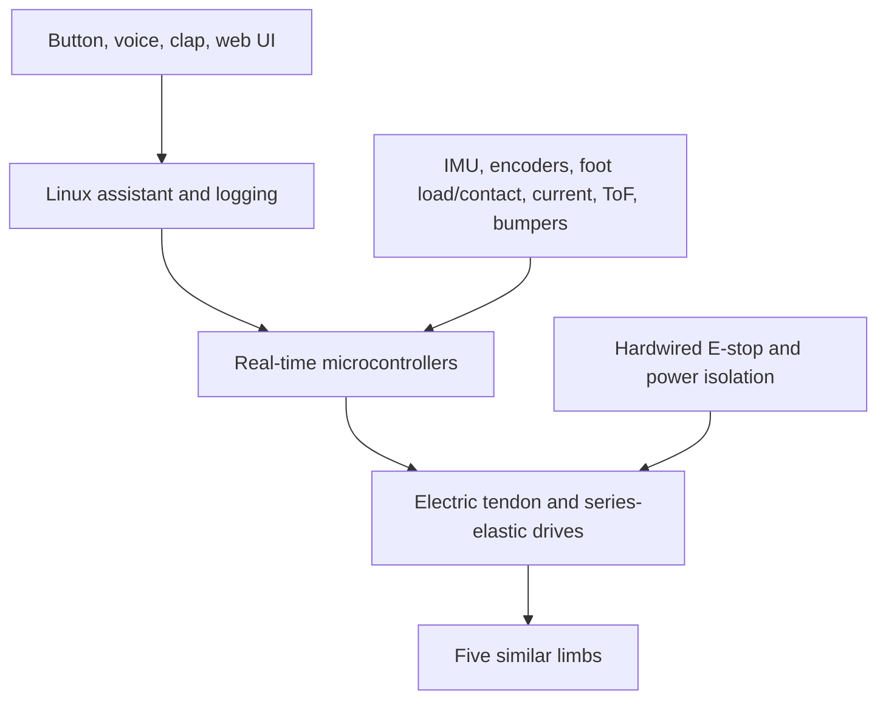

# RPA-1: Rocky-Inspired Pentapod Assistant

RPA-1 is a long-term, student-built robotics platform inspired by Rocky's fivefold symmetry, musical communication, and expressive object use in *Project Hail Mary*. The engineering goal is not to reproduce fictional biology. It is to investigate whether one low-cost, compliant limb architecture can support both pentapod locomotion and expressive manipulation.

The original constructed musical language is named **Chordic**. Its deterministic machine encoding is the Chordic Semantic Protocol, version 1 (`CSP-1`).

> **Status:** requirements and Prototype 1 preparation. No load-bearing hardware has been released for operation.

## Research question

**Can a low-cost fivefold-symmetric robot use the same compliant limb architecture for locomotion and expressive manipulation?**

The current design uses five mechanically similar limbs. Travel uses a conservative wave gait with four feet supporting and one moving. Interaction begins from a stop: Rocky establishes five contacts, shifts into a verified three-foot support triangle, then releases two limbs as arms.

## Non-negotiable constraints

- No wheels, concealed rollers, or powered rolling base.
- Physical emergency stop from the first powered-joint prototype.
- No unsupported full-scale motion around people or pets.
- No homemade pressure vessels or high-pressure hydraulic system.
- No medical or therapeutic claims.
- Device control is limited to equipment owned by, or explicitly authorized for, the operator.
- AI output never directly bypasses the local motion and safety validators.

## Current architecture



Body-mounted electric motors, opposed tendons, and series springs are the leading full-scale actuation direction. Joint-mounted servos provide a faster route to the first small walking prototype. Pneumatic artificial muscles and manual low-pressure syringe hydraulics will be tested on a guarded comparison rig, not assumed to be superior.

## Portfolio Release 1.0 target — May 2028

- Deterministic musical-language encoder, decoder, and Arduino communicator
- Published actuator comparison with force, travel, hysteresis, response, mass, noise, cost, and failure data
- One closed-loop three-DOF tendon limb with a compliant three-finger claw
- 1:3-scale pentapod that walks, turns, stops safely, and demonstrates the three-leg/two-arm transition
- Musical assistant and object-based “explanation theatre” demonstration
- Lightweight full-scale stationary form or interaction module
- Complete CAD, schematics, source code, BOM, risk register, tests, failures, and concise demonstration media

Planned spending through that release is **$1,750 plus $250 contingency**, within a $100/month ceiling. Full-scale unsupported walking is a later research stage, not a claim for this release.

## Repository map

```text
docs/                 requirements, architecture, roadmap, risks, tests
firmware/             microcontroller projects
software/             Linux/Python/ROS 2 applications
hardware/             mechanical design notes and drawings
electronics/          schematics, wiring, and PCB sources
cad/                  source CAD and neutral exports
bom/                  costed bills of materials
language/             CSP musical-language specification and code
perception/           sensor experiments and fusion
interfaces/           translation-mode controls
media/                original diagrams and selected demo media
```

## Start here

## Project navigation

New to RPA-1? Start with the [project index](docs/INDEX.md).

- **Current milestone:** [M0 — Repository and Communication](docs/milestones/M0-repository-communication.md)
- **Current build:** [Rocky Brain v0.1](docs/build-guides/brain-v0.1-build.md)
- **Safety:** [Requirements](docs/requirements/requirements-v0.1.md) and [Risk Register](docs/risk-register/risk-register.md)
- **Chordic / CSP-1:** [Language overview](language/README.md)
- **Roadmap:** [Sophomore-Year Roadmap](docs/roadmap/sophomore-year-roadmap.md)

1. Read [`docs/requirements/requirements-v0.1.md`](docs/requirements/requirements-v0.1.md).
2. Read the [`actuation trade study`](docs/architecture/actuation-trade-study.md).
3. Build and test [`Rocky Brain v0.1`](docs/build-guides/brain-v0.1-build.md) with an Uno R3, two buttons, a passive buzzer, and a connected computer.
4. Do not purchase full-scale actuators until the actuator-comparison test and one-joint gate pass.

Run the current software check with:

```bash
python -m pip install -e .
python -m unittest discover -s language/tests -v
python -m csp.cli encode SOCIAL.hello
```

## Evidence policy

Every claim about the robot must be one of:

- **Movie reference:** supported by official final-film or production material.
- **Book reference:** clearly labeled and not substituted for movie geometry.
- **Engineering assumption:** numbered and awaiting measurement.
- **Demonstrated result:** tied to a dated test report, raw data, and hardware/software revision.

Search-engine summaries and generated answers are leads only. They are not authoritative dimensional or biological sources.

## Intellectual property and licensing

This is an unofficial educational fan-inspired project and is not affiliated with Amazon MGM Studios, Andy Weir, Wētā Workshop, or the filmmakers. Do not commit copyrighted film stills, studio concept art, book text, or third-party CAD/code without permission and a compatible license.

Original code is intended for Apache-2.0 licensing; original hardware/CAD is intended for CERN-OHL-W-2.0; original documentation is intended for CC BY 4.0. License files will be finalized before the first public tagged release.
