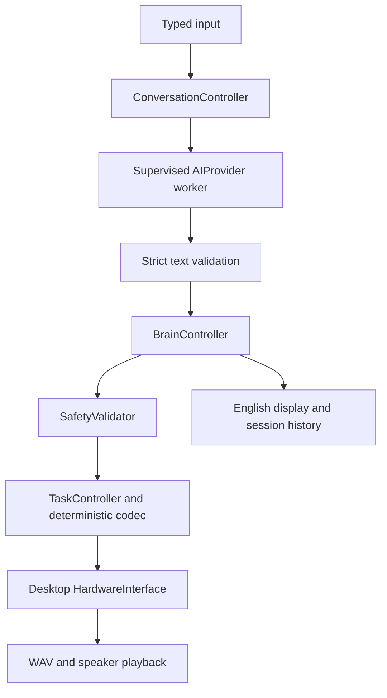

# Decision record: Rocky Conversational Brain V1

**Date:** 2026-10-01  
**Status:** Implemented; READY FOR USER TESTING, not hardware approval  
**Baseline:** `e0eafc3` — Brain v0.2 core  
**Authority:** [Brain v0.2 freeze](brain-v0.2-architecture.md); the owner's V1 request explicitly authorizes local conversation, desktop audio, and a small layered language extension.

## Why this addition is needed

The frozen v0.2 candidate has exactly `intent` and `arg`. Its six registered intents cannot carry an arbitrary sentence. Adding English to `arg`, assigning one greeting to every reply, or letting a model choose notes would break the existing meaning. V1 therefore adds a separate text-only communication contract and capability. Existing v0.2 clients, simulator behavior, CSP assignments, Uno commands and RPA-Link stay compatible.

Repository inspection included README, packaging, both architecture documents, requirements, build guides, milestone pages, brain, CSP, simulator, RPA-Link, browser, firmware and existing tests. The browser still has the serial compatibility issue recorded in the freeze; V1 does not depend on it.

## Data flow and authority

The terminal's main thread owns the brain. Native nonblocking console polling keeps operator commands available during inference (Windows piped input uses a bounded reader). A spawned child receives only the provider configuration, immutable context, bounded conversation history and text. It receives no controller or hardware object and has no tools. This is an application authority boundary, not a sandbox for malicious Python plugins; load trusted code only.

Worker replies are bounded JSON bytes, not pickled model objects. The parent enforces a wall deadline, terminates the child on cancellation/timeout, and discards results when the captured brain session/revision changes. `/stop` cancels the worker before latching the brain and stopping local audio. `/reset` requires explicit operator input and never replays anything. Killing the client does not prove the external inference runtime immediately releases GPU resources.

The existing synchronous `brain.cli` remains the six-intent DummyAI demonstration. Real inference is supported only through the supervised `rocky` application. Do not inject a blocking model into the old synchronous demo and assume it becomes supervised.

Desktop polling is nonblocking and currently returns no asynchronous events. Unexpected events or polling failure latch a stop. Playback receipts use evidence `none`: `ACCEPTED` means the playback API was called, not that a person heard it. WAV-only and muted results mean a file was written. Neither is hardware/sensor evidence.

## Explicit changes to the frozen contracts

| Change | Reason | Compatibility and migration |
|---|---|---|
| Add `submit_utterance({"text": ...})`, immutable `Utterance` and `ConversationOutput` | Six fixed intents cannot express conversation | Existing `submit_text` validation is unchanged. New entry point strictly revalidates, then uses the same safety/task/dispatch path. |
| Add `TEXT_COMMUNICATION` capability | Existing endpoints cannot carry arbitrary text | Only desktop audio advertises it. Simulator and Uno do not acquire it. New adapters must opt in and implement the typed payload. |
| Add CT1 text transport alongside CSP-1 | Exact English requires a reversible representation beyond the finite lexicon | No existing code, note, argument or firmware meaning changes. CT1 is PC-only; never send it as `C1` or `SAY`. |
| Add supervised inference above the brain | Required by the freeze before a real LLM | One worker and one pending request; late work is discarded. Stop and status remain independent. |
| Enable optional desktop audio | Owner's V1 priority | Platform imports live in adapters. Windows uses built-in `winsound`; Linux uses optional pygame. |

All task dispatches still receive two deterministic safety checks, a host request ID, command ID, session and deadline. The model cannot supply any of these, choose a backend, clear a stop, enable motion or manufacture telemetry. Natural-language claims are untrusted conversational content, never state observations. Prompt instructions discourage false physical claims but cannot mathematically guarantee model truthfulness.

## Runtime and model decision

Checked official documentation on 2026-10-01:

| Candidate | Assessment for this project |
|---|---|
| [Ollama](https://docs.ollama.com/windows) | Selected: native Windows installer, model management, schema-constrained local HTTP chat, and an [ARM64 Linux distribution](https://docs.ollama.com/linux). Lowest setup burden for this V1. |
| [llama.cpp](https://github.com/ggml-org/llama.cpp) | Strong portable GGUF option with local server and quantized inference. More manual binary/model/server choices for a beginner. Suitable for a later provider adapter or Pi measurements. |

The runtime is **Ollama**. The initial model choice is **[Qwen3 8B](https://ollama.com/library/qwen3:8b)**, downloaded as `qwen3:8b`. Its local model representation is **GGUF**, managed by Ollama in its own model store. The project adapter is **`rocky.providers.LocalAIProvider`**. These are different layers.

This is a practical initial quality/size choice, not a claim that it is the best current model or that it was benchmarked on Wyatt's computer. Hardware specifications were not supplied. Try `qwen3:4b` if memory or latency is poor; do not assume either runs acceptably on a Raspberry Pi. The model name and timeout are configuration. Another runtime needs only an AIProvider adapter; the brain does not know model names or inference APIs.

The adapter sends history, an editable persona, a strict JSON schema and no tools to `/api/chat`; `think=false` avoids extra reasoning output. It rejects extra keys, duplicate keys, invalid Unicode/control characters, code fences, trailing text, unfinished generation and text over 384 UTF-8 bytes. It does not silently repair or truncate meaning. Replies should normally be one or two short sentences.

Only numeric loopback `127.0.0.1` is contacted; no proxy inheritance, DNS, HTTP redirects, downloads or fallback provider. Before chat, `/api/show` must describe local GGUF data without remote-model fields. Cloud-named models are rejected. Also disable cloud in the runtime using the documented `OLLAMA_NO_CLOUD=1` setting and restart it. See [Ollama FAQ](https://docs.ollama.com/faq), [chat API](https://docs.ollama.com/api/chat) and [structured outputs](https://docs.ollama.com/capabilities/structured-outputs).

## Memory, storage and privacy

The last 12 complete turns, bounded to 12,000 UTF-8 bytes, remain in RAM. Both user text and accepted assistant text return to the model. `/clear` cancels pending work and drops that history and last translation. No database or training pipeline is added. Context can age out; this is not long-term memory.

`~/.rpa1/conversation-v1/events.jsonl` contains brain metadata, not conversation text. `last-response.wav` is overwritten by each accepted reply. CT1 encodes text reversibly, so treat that WAV as conversation data. `/clear` does not erase the WAV or Ollama's own files. Delete the WAV manually if wanted. Do not commit output or model weights.

## Portability and scope

Python requirement remains `>=3.10`. Current supported installation is an editable **full source checkout**, because the existing CSP YAML loader still requires `language/specification/`. A wheel-only deployment needs the packaging repair already described in the freeze; V1 does not claim wheel independence.

Phone translator is deferred. The core has no HTTP listener and no LAN exposure. Voice input has only a `SpeechInput` protocol for V2; no microphone package is installed or used. No serial/motor/sensor module is added. A future microphone returns text into the same `ConversationController.start` path.

## Review triggers

Revisit these choices after a real Windows listening/session test, measured inference latency/memory, a Pi hardware selection, or before any physical action capability. Acoustic recognition needs measured recordings and error tests; CT1 symbol decoding does not establish sound recognition. Do not weaken validation to hide model-format failures.
