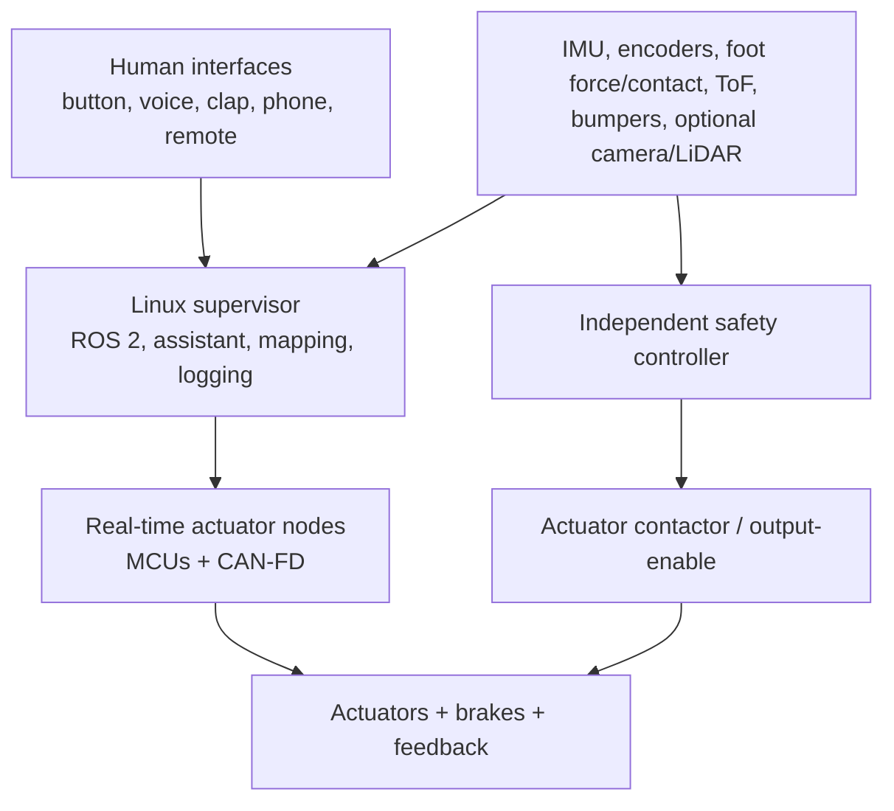
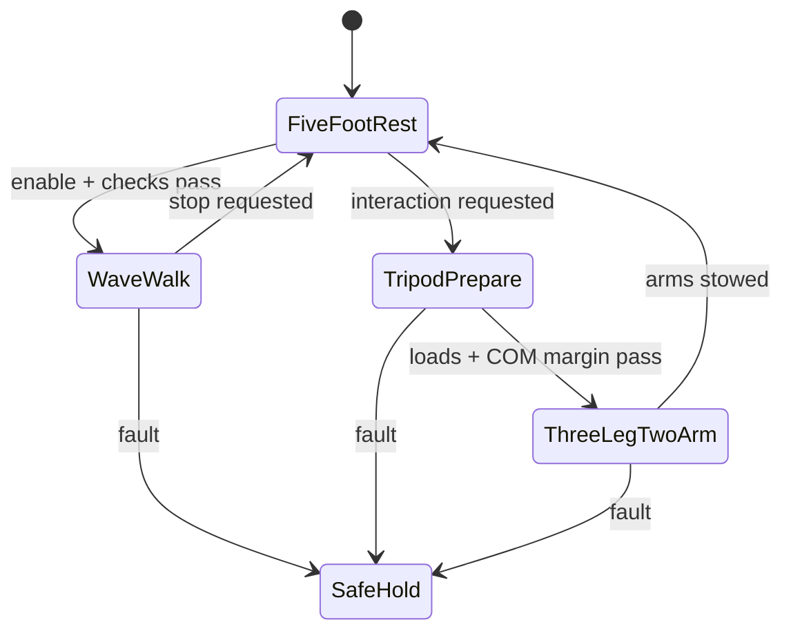

# RPA-1 Engineering Baseline v0.3

**Project:** Rocky-inspired Pentapod Assistant (RPA-1)
**Date:** 2026-09-30
**Owner/builder:** Wyatt Koerner
**Status:** Planning baseline; no moving hardware yet; v0.3 adds the bio-inspired tendon/series-elastic actuation direction and a sub-$2,000 sophomore-year portfolio program
**Purpose:** Portfolio, university proposal, faculty/makerspace review, grant planning, internship discussion, GitHub, and future research

> This is a staged educational robotics project, not a medical device, security tool, or autonomous product ready for public operation. “Morale support” means companionship, encouragement, study help, reminders, and social interaction—not therapy, diagnosis, crisis response, or treatment.

## Executive decision

The project is credible as a **lightweight, true-walking pentapod research platform whose long-term visual target is the movie version of Rocky**. Wheels are explicitly rejected as a design solution. The preferred mature behavior is five-limb maneuvering. The practical first gait is a slow static wave gait: lift and place one limb at a time while the other four remain on the floor. For conversation and object-based explanation, Rocky stops, shifts his center of mass into a verified three-foot support triangle, and uses the two designated front limbs as arms.

The five limbs should be mechanically similar wherever the mass and budget permit. “Front” and “rear” are initially software roles and a preferred body orientation, not necessarily different limb hardware. Free role switching among all five limbs is a North Star; the first safe version may use fixed front/back roles to reduce control complexity.

The recommended path is:

1. Build the musical-language and Arduino communicator now.
2. Learn closed-loop control on one guarded joint.
3. Prove one lightweight three-DOF limb and compliant three-finger gripper.
4. Validate five-limb wave gaits and mode transitions at 1:3 to 1:4 scale.
5. Build a low-mass full-scale shell and stationary expressive system.
6. Validate full-scale load-bearing motion under a rated support rig.
7. Release true walking only after torque, mass, stability, stop, and endurance gates pass; LiDAR remains an optional later mapping module.

### v0.2 governing constraints and assumptions

- **No wheels:** this is a stakeholder requirement, so a wheel solution cannot win a weighted trade study regardless of convenience.
- **Budget:** purchases average no more than **$100/month**. Large purchases are saved for across multiple months and require a decision record.
- **Working body volume:** **22 L**, supplied by the builder and awaiting authoritative movie-reference verification. This refers to the central carapace, not the swept volume of the limbs.
- **Working mobile mass target:** **8–10 kg**, with a **12 kg review threshold**. Exceeding 12 kg triggers actuator, stability, structure, battery, and injury-risk re-analysis before more parts are added.
- **Interaction behavior:** the front two limbs may become expressive arms only after the robot is stationary and the remaining three feet have verified support loads and stability margin.
- **Perception:** LiDAR is desirable but optional. Safe maneuvering initially relies on joint feedback, IMU, foot contact/load sensing, motor-current sensing, bumpers, and downward/short-range ranging; cameras or LiDAR may be added for tasks that justify them.
- **Primary expressive-manipulation use case:** Rocky explains ideas with a small library of lightweight props, tokens, cards, and pointers before attempting general household manipulation.

### v0.3 actuation and near-term portfolio decision

- **Primary actuation direction:** body-mounted electric motors driving opposed tendons/cables, with deliberate series elasticity, local position feedback, tendon-tension or spring-deflection sensing, and lightweight distal links. This copies the useful organization of biological muscle–tendon systems without requiring biological tissue or fluid power.
- **Pneumatic artificial muscles:** retain as a guarded, low-energy comparison experiment. They are light and contractile, but full-robot use would require many proportional valves, pressure sensors, regulators, a compressor or rated reservoir, leak management, and nonlinear pressure/length control.
- **Hydraulics:** test only with a low-pressure manual syringe demonstrator. Do not place an onboard hydraulic power unit in the sophomore-year robot; high-pressure leaks, pumps, servo valves, reservoirs, filtration, and maintenance conflict with the mass, budget, noise, and beginner-safety requirements.
- **Fiction boundary:** do not reproduce superheated mercury, flash boiling, steam-powered tissue, sharp weight-bearing claws, instant snapping motion, or unrestricted 360° cable-twisting joints. The attached search summaries are leads, not authoritative film anatomy.
- **Sophomore-year portfolio target:** assuming the academic year ends around May 2028, produce a measured actuator comparison, one closed-loop three-DOF tendon limb with compliant claw, a walking/turning 1:3-scale pentapod capable of a demonstrated three-leg/two-arm transition, the musical-language/assistant software, and a full-scale lightweight stationary interaction mock-up. Full-scale unsupported walking is not required for this release.
- **Near-term spending ceiling:** no more than $2,000 cumulative from October 2026 through May 2028 at the existing $100/month maximum, with a working target of $1,500 plus $500 contingency.

## 1. Refined project definition

### Project name

**RPA-1 — Rocky-inspired Pentapod Assistant**

For public-facing work, use the neutral subtitle **“Pentapod Embodied Assistant Research Platform.”** State that it is an unofficial fan-inspired educational project and is not affiliated with Amazon MGM Studios, Andy Weir, Wētā Workshop, or the filmmakers.

### Mission statement

Design and validate a safe, modular, lightweight, life-scale pentapod robotic companion that combines true five-limb locomotion, expressive animatronics, deterministic musical communication, multimodal spatial perception, conversational assistance, and carefully limited physical interaction.

### Formal problem statement

Students and engineers who study or build alone often rely on screen- or speaker-based assistants that can provide information but little persistent physical presence, expressive movement, or embodied help. Existing consumer assistants also provide limited opportunities to study real-time control, sensing, power electronics, mechatronics, safety, and human-robot interaction as one integrated system. The RPA-1 project will investigate whether a modular, life-scale, Rocky-inspired robotic platform can provide non-medical companionship, study assistance, reminders, expressive musical interaction, environmental awareness, and supervised lightweight assistance while remaining measurable, repairable, privacy-conscious, and safe. The project will be evaluated through staged prototypes with explicit performance and safety tests rather than through claims of fictional equivalence.

### Proposed solution

Create a distributed robotic platform with a lightweight serviceable frame, removable movie-inspired shell, five similar three-DOF limb modules, compliant three-finger end effectors, a deterministic constructed tonal language, an independent local safety layer, modular perception, Linux/ROS 2 supervisory software, and microcontroller-based real-time I/O. Travel uses all five limbs; the two front limbs become expressive arms only in a verified stationary three-leg stance. Riskier capabilities—unsupported walking, autonomous movement, manipulation, door operation, and radio control—remain disabled until their subsystem acceptance gates are passed.

### Intended users

- **Primary:** Wyatt, as builder, operator, and learner.
- **Secondary:** faculty mentors, makerspace staff, classmates, recruiters, and research collaborators observing controlled demonstrations.
- **Future research participants:** only under an approved protocol if human-subject research is ever conducted.
- **Not initially intended:** unsupervised consumers, children, medical users, public crowds, or operation around pets.

### Primary use cases

1. **Study companion:** timers, reminders, checklists, project help, and encouraging social interaction.
2. **Expressive musical communication:** reversible English ↔ structured meaning ↔ Rocky-language translation with body gestures and lights.
3. **Spatial assistant:** obstacle awareness, supervised following, and navigation on an approved indoor test course, with mapping added only if the selected sensors and use case justify it.
4. **Engineering testbed:** experiments in controls, sensing, CAD, power, ROS 2, AI, safety, and human-robot interaction.
5. **Supervised physical/electronic assistance:** moving very light objects and controlling only allowlisted equipment owned by or explicitly authorized for the operator.

### Top-level measurable success criteria

| Area | Baseline success criterion |
|---|---|
| Appearance | Confirmed dimensions reproduced within ±5%; estimated dimensions labeled and updated as better references appear; silhouette judged recognizable by at least 8 of 10 blinded viewers. |
| Musical language | ≥99% software round-trip accuracy on valid messages; ≥95% over-speaker/microphone token accuracy in a quiet room; no invented translation when checksum or confidence fails. |
| Translation | Physical-button response ≤250 ms; decoded text begins ≤1.5 s after phrase completion for local processing; confidence and unresolved fields shown. |
| Clap trigger | ≥95% detection of the enrolled pattern across 50 trials; <1 false activation per 8 hours in the defined background-noise test set; never used for a safety-critical command. |
| Voice trigger | ≥90% correct activation across 50 quiet-room trials and ≥80% in the defined noisy condition; physical button remains authoritative. |
| Optional mapping module | If LiDAR is added: median range error ≤50 mm from 0.5–6 m indoors; mapped wall-length error ≤2%; loop-closure displacement ≤150 mm on the defined course. |
| Joint prototype | Commanded-position repeatability ≤2° unloaded and ≤3° at rated test load; limit, current, temperature, and E-stop tests all pass. |
| Expressive motion | No unexpected motion in 100 startup/shutdown cycles; operator-rated recognizable pose set ≥90%. |
| Initial mobility | Five-limb wave gait at ≤0.05 m/s, one swing limb at a time, ≥30 mm static stability margin, supervised on a level closed course, and stopped by any stale command or lost foot-contact state. |
| Interaction stance | Transition from five feet to three-foot support only while stationary; three stance feet confirm load; center-of-mass projection remains ≥30 mm inside the support triangle before either arm is released. |
| Manipulation | 0.05 kg first prop payload, progressing to 0.25 kg only after tests; compliant grip; release or safe hold on fault as explicitly selected for the object; contact force initially limited to 10 N except on a guarded instrumented fixture. |
| Safety | Local E-stop removes actuator power within 100 ms in the test configuration; logic remains alive to log the event; reset never causes automatic motion. |
| Documentation | Every phase has requirements, schematics, CAD, BOM, code version, risk review, test plan, raw results, failures, and a short demonstration video. |

These are engineering targets, not a claim of compliance or certification. ISO 13482 is a useful hazard framework for non-medical personal-care robots, including foreseeable hazards to people, animals, and property; ISO 13850 provides general emergency-stop design principles. Formal compliance requires qualified review and the full standards.

### Limitations and truth labels

| Label | Meaning | Examples |
|---|---|---|
| Movie-accurate appearance | A visual target supported by final-film references. | Silhouette, five limbs, rocky/faceted shell, color, characteristic poses. |
| Demonstrated physical capability | Passed a written test on the actual build. | A measured joint range, 30-minute runtime, map accuracy, controlled button press. |
| Engineering approximation | Preserves the experience but not the fictional mechanism. | Electronic sensing in place of alien biology; speaker-generated language; standardized lightweight props. |
| Impractical/unsafe/fictional | Not promised and may never be built. | Alien biology, movie-level strength/agility, extreme heat tolerance, universal device control, unrestricted autonomous door opening. |

### Why this is an EE/robotics project, not only a prop

The exterior is only one subsystem. The project requires power architecture, protection, embedded real-time firmware, motor drives, sensing, feedback control, kinematics, state estimation, mapping, human-machine interfaces, audio DSP, networking, AI integration, fault handling, verification, and configuration control. A defensible portfolio emphasizes measured requirements and failed/passed tests as much as visual finish.

## 2. Reality and feasibility assessment

**Difficulty scale:** 1 = beginner weekend task; 10 = research-grade and potentially hazardous. “Student reasonable” refers to a staged prototype, not unrestricted public use.

| Capability | Difficulty | Major risks | Knowledge needed | Earliest stage | Student reasonable? | Safer/simpler substitute |
|---|---:|---|---|---|---|---|
| Static 1:1 visual replica | 3 | size error, weight, copyright/derivative-design issues | reference analysis, CAD, foam/shell fabrication | 5 | Yes | cardboard/foam silhouette mock-up first |
| Expressive body movement | 4 | pinch points, servo stalls, uncanny/jerky motion | servos, linkages, motion curves | 2–5 | Yes | low-force stationary gestures |
| Stationary animatronics | 5 | unexpected motion, overheating, shell interference | distributed control, wiring, mechanical stops | 5 | Yes | tethered power and fixed base |
| Supported leg movement | 6 | falling test article, high joint loads | statics, torque, feedback, test fixtures | 3/6 | Yes with a stand | unloaded limb on rigid stand |
| Full-scale five-limb locomotion | 9 | fall/crush, actuator and battery cost, foot slip, unstable transitions | statics/dynamics, gait control, structural analysis, functional safety | 7+ | Reasonable only as a multi-year supervised research goal | rated overhead support until release; one-limb-at-a-time wave gait |
| Stable turning on true legs | 8 | support-polygon loss, foot slip, cable fatigue | gait planning, force sensing, state estimation | 7 | Research goal | small yaw increments using four support feet |
| Following a person | 9 | target swap, collision, privacy, gait instability | tracking, localization, planning, five-limb control | 8 | Later research goal | operator-selected beacon and dead-man teleoperation at walking speed |
| Autonomous navigation | 8 | blind spots, stairs, dynamic obstacles, gait/route coupling | ROS 2, planning, state estimation, sensor fusion | 8 | Limited closed-course goal | waypoint teleoperation with an independent collision monitor |
| Rocky-like musical communication | 3 | unpleasant audio, ambiguous tokens | music basics, DSP, protocol design | 1 | Yes | fixed pentatonic token set |
| Speech recognition | 3–5 | noise, privacy, false wakeups | microphones, ASR, wake words | 1C/8 | Yes | push-to-talk first |
| Conversational AI | 4 cloud / 6 local | hallucination, latency, privacy, unsafe commands | APIs/local models, tool permissions, validation | 8 | Yes if sandboxed | text assistant with no motion authority |
| Long-term memory | 5 | wrong memories, sensitive data, retention | databases, consent, access control | 8 | Yes | explicit user-approved notes only |
| Object detection | 5 | false labels, lighting, privacy | cameras, CV, dataset limits | 8 | Yes | tags/AprilTags; LiDAR only for geometry |
| Lightweight manipulation | 7 | pinching, drops, force spikes | compliant control, grippers, force sensing | 9 | Yes on a fixture | 0.25 kg objects and foam gripper |
| Ordinary door handle | 9 | property damage, trapping, high force, variable geometry | force control, mobile manipulation, compliance | 9+ | Only controlled research | instrumented handle rig; accessibility button |
| Authorized accessibility button | 5 | misalignment, unwanted activation | perception, compliant pressing | 9 | Yes with permission | supervised teleoperation |
| Smart-home/IR device control | 3–4 | wrong target, account/security mistakes | APIs, IR protocols, allowlists | 8/9 | Yes | official API/owned TV only |
| NFC/RFID/sub-GHz lab research | 6 | legal/security boundary, interference | RF basics, regulations, explicit scope | 9 | Only controlled/authorized | passive tags and shielded personal fixtures |
| Useful battery operation | 7 | fire, undervoltage, peak current, charging | energy budget, BMS, fusing, connectors | 7+ | Yes with a protected commercial pack | tethered bench supply during development |

### The load calculation that controls the project

Revised planning assumption: **8 kg total robot mass**. In the stationary interaction pose, three feet carry the body. In the conservative travel gait, four feet remain planted while one limb swings. These first-pass calculations assume equal load sharing; real joints must also tolerate uneven terrain, acceleration, leg geometry, and transient impact.

For the three-foot interaction stance:

\[
F_{leg}=\frac{mg}{3}=\frac{8(9.81)}{3}\approx26.2\;N
\]

At a compact 0.15 m horizontal moment arm:

\[
\tau_{static}\approx26.2(0.15)=3.9\;N\cdot m,\qquad
\tau_{design}\;(2\times)\approx7.8\;N\cdot m
\]

At a less favorable 0.25 m moment arm, the same joint reaches about **6.5 N·m static** and **13 N·m design torque**. With four evenly loaded stance feet and a 0.15 m arm, the corresponding figures are about **2.9 N·m static** and **5.9 N·m design**.

This is dramatically more attainable than the former 30 kg assumption, but a nominal “35 kg·cm” hobby servo provides only about 3.4 N·m at stall, not safe continuous torque. The full-size design must use compact crouched geometry, measured duty cycles, adequate reduction and bearings, spring/counterbalance assistance where useful, and actuators selected from continuous—not marketing stall—ratings. Final values require a multibody model and instrumented limb test.

### First energy estimate

A lightweight slow walker might average roughly **150–400 W** once measured, while short peaks could exceed 1 kW. A hypothetical protected 24 V, 15 Ah commercial pack stores 360 Wh; using 80% gives 288 Wh, or about **43–115 minutes ideal** across that range before reserve, conversion loss, aging, and temperature derating. This is a sizing example—not permission to build a pack. Measure the small prototype and one full-size limb before choosing voltage or capacity; use a professionally assembled protected pack, matched charger, contactor/precharge where required, fuse, enclosure, and faculty review.

## 3. Reference and dimensional research plan

### Reliable public reference set

| Source | What it establishes | Limitations |
|---|---|---|
| [Amazon MGM official trailers and clips](https://www.youtube.com/playlist?list=PLwwhtOnMyjuzKtsvy3LE17oZA3D3fKbfj) | final on-screen silhouette, surface, color under varied lighting, characteristic motion and interactions | lenses, perspective, grading, VFX, and edits distort measurement |
| [Wētā Workshop project page](https://www.wetaworkshop.com/projects/project-hail-mary) | official early creature exploration; five limbs, eyeless design, mineral/blue color ideas, movement and acoustic concepts | concept exploration is not guaranteed to match final puppet geometry |
| [Wētā Design Studio ArtStation page](https://wetaworkshopdesignstudio.artstation.com/projects/o0bYqW) | multiple official concept views and credits; confirms final build moved to Neal Scanlan’s team | “all rights reserved”; do not redistribute as project assets |
| [Official production notes](https://www.samdb.co.za/titleproductionnotes/2591) | multiple puppet/animatronic versions and behavior-led design process | no verified dimension sheet published there |
| “Creating Rocky” official featurette in the Amazon playlist | scale against performers, rods, floor, hands, and puppet mechanisms; useful multiple angles | behind-the-scenes lens distortion and partially hidden geometry |
| [IFLScience Creature Shop visit](https://www.iflscience.com/project-hail-mary-behind-the-scenes-how-rocky-the-alien-came-to-life-using-out-of-this-world-puppet-technology-83327) | authorized photos with people; manual puppet plus remote/Waldo-style animatronic | people are not exact scale bars unless their dimensions are independently known |
| [James Ortiz interview / production discussion](https://www.inverse.com/entertainment/project-hail-mary-puppet-james-ortiz-interview) | puppet variants, performance constraints, practical motion intent | qualitative, not a mechanical drawing |

The final puppet was a practical/digital hybrid, not an autonomous robot. Production accounts describe a manual rod-operated version and more complex animatronic/remote versions. That is useful evidence that **different mechanisms for different shots** is more realistic than forcing one mechanism to do everything.

### Movie vs. book

- **Movie design authority:** final-film frames and official production imagery.
- **Book description:** biological/lore reference only. The “large dog/Labrador-sized,” five-limbed, rock-like Eridian description is helpful but does not define the final movie surface or proportions.
- Keep two CAD configurations: `MOVIE_REFERENCE` and `BOOK_INTERPRETATION`. Do not average them.

### Scale-estimation workflow

1. Capture at least 20 authorized study frames: front-ish, rear-ish, both sides, high/low angle, neutral stance, extended limb, and interaction with a known object.
2. Record frame timecode, source URL/title, camera/lens clues, and whether the view is puppet, animatronic, or VFX.
3. Prefer rigid known objects in the same depth plane: measured set panels, a verified tape measure, standardized hardware, or a calibrated reference placed beside a publicly displayed prop.
4. Use people only as secondary references; account for pose, shoes, crouching, and distance from camera.
5. Correct perspective with vanishing points and camera calibration. Never measure raw pixels across different depth planes as though they share one scale.
6. Fit a common proportional CAD skeleton to multiple views. Optimize one set of dimensions across all frames and retain residual errors.
7. If a rotating featurette provides sufficient parallax, perform photogrammetry only as a rough surface prior; reflective facets, motion, compression, and missing views will create artifacts.
8. Build a cardboard/foam 1:1 silhouette and photograph it beside a measured person before committing to final structure.
9. Assign every dimension a source, date, method, uncertainty, and confidence. Upgrade a value only when independent views agree.

### Dimensional-confidence table v0.1

No reliable public final-puppet dimension drawing was located in this research pass. The numeric ranges below are **planning envelopes**, not facts.

The builder-supplied screenshots are search-engine summaries, not primary references. Their claimed 18 in width, 9 in maximum thickness, 1.5–2 ft limb length, 3 ft footprint, and 5–6 ft reach are useful leads but must not be entered as confirmed movie dimensions. The **22 L** carapace volume is likewise a working design input until its source is verified.

There is also a useful geometry check: a uniform regular pentagonal prism that is 18 in across vertices and 9 in thick would contain about **28.4 L**; if 18 in means across flats, it would contain about **43.4 L**. Holding 18 in across vertices and 22 L requires about **7.0 in average effective thickness**. Therefore 22 L and a 9 in *maximum* thickness can coexist if the body is tapered/faceted rather than a constant-thickness prism.

| Feature | Current value | Status/confidence | Basis / next verification |
|---|---:|---|---|
| Limb count | 5 | Confirmed, high | official film and Wētā material |
| Eyes/face | no human-style eyes; faceless center of focus | Confirmed, high | official design/film |
| Surface | faceted rock/mineral-like, dark with blue/copper-mine influence | Confirmed qualitative, high | Wētā and final footage |
| General scale | large-dog/Labrador-sized | Confirmed qualitative, medium | book/production descriptions |
| Resting overall height | 0.55–0.75 m | Estimated, low | early human/prop comparison; measure across ≥5 corrected frames |
| Central carapace width | 0.457 m / 18 in working value | Book-derived/secondary, low for movie | verify against official multi-view movie frames; do not treat screenshot summary as authority |
| Central carapace maximum thickness | 0.229 m / 9 in working value | Book-derived/secondary, low for movie | interpret as maximum, not uniform prism thickness |
| Central carapace volume | 22 L | Builder-supplied target, unverified | reconcile with multi-view CAD volume after perspective-corrected measurements |
| Maximum stance diameter | 1.10–1.55 m | Estimated, low | early screen envelope only |
| Proximal limb segment | 0.25–0.38 m | Estimated, low | proportional sketch; not fabrication-ready |
| Distal limb segment | 0.28–0.42 m | Estimated, low | proportional sketch; not fabrication-ready |
| Joint axes and exact ranges | TBD | Unknown | reconstruct from multiple poses and physical interference study |
| Final robot mass | target 8–10 kg; review required above 12 kg | Engineering requirement, not movie data | allocate and weigh every subsystem; walking feasibility depends strongly on this target |
| Puppet mass/material stack | fiberglass reported qualitatively; exact mass TBD | Partly known / unknown | request information from production sources if appropriate |
| Movie color values | TBD under neutral reference light | Unknown | derive from color-managed stills; grading prevents absolute values |

## 4. Modular system architecture



### Mechanical layers

- **Primary structure:** modular center frame with five identical mounting sectors. Use thin-wall aluminum or composite tubes for load paths; design the cosmetic shell to carry no structural load.
- **Exterior:** lightweight removable printed panels, foam, thin balsa skins/ribs, or a hybrid hard faceted shell over local energy absorption, with soft joint bellows. Balsa and ordinary printed plastic must not carry concentrated joint loads unless coupon testing and analysis validate them.
- **Limbs:** target three load-bearing DOF per limb for three-dimensional foot placement and turning. Use five mechanically similar limb modules if practical. All five support travel; a checked stationary transition frees the two designated front limbs for gesture/manipulation.
- **End effectors:** each limb may ultimately have a three-finger adaptive clamp/foot. Begin by actuating only the two front grippers; use one tendon actuator, spring opening, compliant fingertips, and a separate broad load-bearing foot interface. Do not transmit walking loads through delicate finger hinges.
- **Transmissions:** small prototypes may use smart servos or geared DC motors. Full-scale candidates are selected from measured continuous torque, backlash, efficiency, thermal, and backdrive requirements; BLDC is not mandatory if a lower-cost geared solution passes those tests.
- **Bearings:** loads go through bearings and structure, not motor shafts or plastic servo horns.

### Locomotion/interaction mode logic



`TripodPrepare` is deliberately cautious: place all five feet; stop body motion; shift the body toward the three selected stance feet; verify their contact/load estimates; check the estimated center-of-mass projection against the support triangle; lift the first front limb; recheck; then lift the second. Return both arms to verified contact before walking. `SafeHold` is configuration-dependent: a load-bearing fault may require controlled lowering or mechanical braking rather than blindly cutting torque and causing a fall.

The rear-three stance is not automatically stable in a regular pentagonal layout. If the two adjacent front feet are lifted and the nominal foot radius is (R), the forward edge of the remaining three-foot triangle lies approximately (0.309R) behind the body center because \(\cos 108^\circ\approx-0.309\). Therefore the required rearward center-of-mass shift is at least

\[
d_{shift} > 0.309R + m
\]

where (m) is the desired stability margin. At (R=0.45\;m), this is about **0.14 m merely to cross the edge**, **0.17 m for a 30 mm margin**, or **0.19 m for a 50 mm margin**. Actual foot placement, body orientation, link mass, prop mass, and floor slope change the result. The small-scale prototype must demonstrate the shift and measure the support polygon before the interaction mode is accepted.

### Electronics and control layers

| Layer | Recommended responsibility | What it must not do |
|---|---|---|
| Arduino Uno/Nano | Phase-1 buttons, LEDs, passive piezo, simple state machine; later a single low-rate sensor/actuator experiment | speech, mapping, ROS 2, high-current switching, or sole safety supervision |
| ESP32 | I²S audio, clap features, Wi‑Fi/BLE UI, local limb I/O, telemetry, FreeRTOS tasks | act as the only E-stop path or run unbounded AI code beside motor timing |
| Raspberry Pi 5 / used mini-PC | Linux, Python, web UI, database, ROS 2, 2D SLAM, speech front end | hard real-time commutation or certified safety |
| Jetson-class computer | only when measured camera/neural workloads exceed Pi/mini-PC capacity | purchase merely for prestige; it adds cost, heat, and power |
| Custom PCB | stable repeated interfaces, protected I/O, current sensing, connectors, CAN nodes, power distribution | first prototype; do not freeze unknown requirements into a board |

### Communications

- **CAN-FD** for long-term limb/actuator nodes: differential, robust, message-priority capable, and easier to fault-contain than long I²C runs.
- **Ethernet/USB** for optional LiDAR, cameras, and other high-bandwidth sensors.
- **UART/SPI** for local modules and IMUs.
- **I²C only within a short local harness or PCB**, not across moving full-scale limbs.
- Every actuator node needs a heartbeat timeout, sequence numbers, command age limit, local limits, and a safe state that does not depend on Linux.

### Sensors

- Required near-body safety: joint/limb geometry, five foot-contact/load measurements, bumpers, motor-current anomaly detection, and short-range/downward ranging.
- Optional wider-area geometry: 360° 2D LiDAR, 3D LiDAR, or depth camera when mapping/following requirements justify the cost and compute.
- State: IMU, absolute/relative joint encoders, motor current, winding/driver temperature.
- Contact/stability: foot load cells or force-sensitive elements, bumpers, and contact switches.
- Near-field/drop-off: downward and short-range ToF sensors; LiDAR alone does not make stairs safe.
- Interaction: microphone array and speaker; optional cameras for people, color, text, screens, and object identity.
- Privacy: camera power-disable switch, microphone mute, visible indicators electrically tied to sensor power, local processing option, and retention off by default.

### Optional LiDAR architecture

- **First cart:** a low-cost 360° **2D** scanner such as an RPLIDAR A1/C1 class device. It produces a horizontal plane, not a 3D map.
- **3D experiment:** tilt a 2D scanner only while stationary, or use a genuine 3D unit later. A sensor such as the Livox Mid-360 class provides 360° horizontal and roughly 59° vertical coverage, but it is a later-stage expense and does not remove blind spots beneath the body.
- **Placement:** upper central body with a rigid mount, known transform, vibration isolation that does not wobble, airflow, and an optically tested window. Add low downward sensors near the footprint.
- **Motion effects:** body motion distorts scans; timestamp LiDAR, IMU, and joint data, estimate the sensor pose, and motion-compensate where supported.
- **Window candidates:** clear optical-grade PMMA or polycarbonate for prototypes; purpose-made 905 nm/940 nm NIR-transmitting glass/polymer and AR coatings for the final system. Ordinary paint, opaque resin, foam, fabric, and silicone are not acceptable optical paths. Visually dark RG905-class glass can be considered only after wavelength and transmission tests.

### Power and shutdown

- Separate **logic**, **sensors**, **audio**, and **actuator** power domains.
- Branch fuses close to the source; keyed/polarized locking connectors; strain relief; wire gauges selected from continuous and fault current, not average logic draw.
- Physical red mushroom E-stop uses normally closed contacts to de-energize actuator enable/contactor. Logic stays powered for fault logging where safe.
- Wireless stop is a redundant stop request with heartbeat and authentication; it is never the only emergency stop.
- Battery system needs a matched BMS, charger, main fuse, disconnect, precharge where required, contactor, current/voltage/temperature monitoring, nonflammable enclosure strategy, and documented charging location.
- Safe startup: actuator power inhibited, command buffers cleared, brakes/supports checked, sensors plausibility-tested, manual enable required.
- Safe shutdown/fault: stop commands, controlled support where possible, actuator power removal appropriate to the test setup, no automatic restart.

### Software services

- `safety_supervisor`: reads hardwired status plus software limits; cannot be overridden by the personality system.
- `motion_manager`: validates limits, collision envelope, mode, and command freshness.
- `kinematics`: URDF/CAD-derived forward/inverse kinematics and gait planning.
- `perception`: IMU/encoder/contact/near-field fusion, obstacles, optional maps/LiDAR, and optional semantic camera layer.
- `assistant`: speech, dialogue, reminders, and memory with explicit permissions.
- `rocky_language`: validated semantic IR, encoder/decoder, audio synthesis/recognition, confidence.
- `device_gateway`: allowlisted official APIs/protocols with audit log and physical enable for higher-risk actions.
- `teleop`: dead-man control, speed limits, and local collision checks.
- `diagnostics`: synchronized logs, fault codes, temperatures, currents, battery, message latency, and test IDs.

### Authorized device interaction boundaries

| Capability | Allowed design | Boundary |
|---|---|---|
| Physical door handle | supervised compliant manipulator on an instrumented test door, then a specifically authorized door | no locks, forced entry, or unsupervised public doors |
| Accessibility button | compliant press after explicit permission | confirm target and prevent repeated activation |
| Smart-home device | official authenticated API and allowlist | no credential extraction or bypass |
| Infrared | learned/documented commands for electronics you own | no targeting others’ equipment |
| NFC/RFID/sub-GHz | passive tags and controlled lab fixtures you own or are authorized to test | no cloning access credentials, replaying unknown signals, jamming, or interference |

## 5. Phased development roadmap

Costs are rough 2026 U.S. student-budget ranges, exclude the computer you already own, and should be re-quoted before purchase. Time assumes part-time work during school and includes iteration.

### Sophomore-year portfolio release schedule

This schedule assumes sophomore year ends in **May 2028**. Adjust the dates when the builder confirms the school calendar. The goal is not a rushed full-scale walker; it is a coherent chain of functioning prototypes, measurements, revisions, and truthful demonstrations.

| Date gate | Demonstrable result | Acceptance evidence | Cumulative target spend |
|---|---|---|---:|
| Nov 2026 | Public-ready repository, language encoder/decoder, Arduino musical communicator | reproducible setup; schema round trip; buttons/audio demo; first test report | $75 |
| Feb 2027 | Standardized actuator-comparison joint: electric tendon, low-pressure pneumatic specimen, manual syringe-hydraulic specimen | force/travel, response, hysteresis, repeatability, noise, mass, cost, failure behavior; guarded video | $250 |
| May 2027 | One closed-loop three-DOF tendon-driven limb with compliant three-finger claw on a stand | endpoint path test, spring/tendon-force estimate, current/temperature logs, E-stop and cable-failure tests | $550 |
| Sep 2027 | 1:3-scale five-limb robot assembled and individually calibrated | five three-DOF limbs, foot sensing, current budget, safe startup, body-pose demonstration | $1,000 |
| Dec 2027 | Stable five-limb walking and turning plus stationary three-leg/two-arm transition | 2 m forward course, 90° turn, 20 successful interaction transitions, heartbeat-loss stop, 30-minute duty test | $1,250 |
| Mar 2028 | Musical assistant and explanation theatre integrated with the scale robot | deterministic translation, physical mode button, six recognized gestures, five standardized props, opt-in memory demo | $1,500 |
| May 2028 | Portfolio Release 1.0: scale mobile robot plus lightweight full-scale stationary form/interaction module | concise technical report, CAD/code/BOM/test data, failure history, build-process photos, ≤2-minute motion reel, independent mentor review | $1,750 |
| Reserve | replacements, shipping, failed parts, safety hardware | spending log and approval record | **$250; $2,000 hard program ceiling** |

The application-quality research question is: **Can a low-cost fivefold-symmetric robot use the same compliant limb architecture for locomotion and expressive manipulation?** Each prototype should answer one part of that question quantitatively.

### Phase 0 — Requirements, references, and project control

- **Objective:** establish the evidence base, reference register, dimensional model, safety policy, GitHub repository, risk register, and initial mass/power budgets.
- **Learn:** Git basics, requirements writing, source evaluation, perspective error, risk scoring, simple CAD sketches.
- **Parts/tools:** tape measure, scale references, cardboard/foam board, free CAD, GitHub; optional color card and laser distance meter.
- **Cost/time:** $0–75; 2–4 weeks.
- **Main risks:** scope explosion, treating concept art as final geometry, copying copyrighted assets into the repo.
- **Acceptance:** ≥20 cataloged reference views; every important dimension has confidence/source; ≥30 uniquely numbered requirements; top-12 risk register; 1:1 cardboard silhouette reviewed in a measured room.
- **Video:** 90-second “design target and engineering reality” presentation beside the silhouette.
- **Portfolio evidence:** problem/solution statement, source matrix, first CAD skeleton, assumptions, mass budget, risk heat map, ADR-0001 architecture choice.
- **Gate:** do not buy final-scale actuators or fabricate a shell until the reference and mass envelopes are reviewed.

### Phase 1 — Rocky Communication Core

This phase contains three linked prototypes.

**1A. Language software prototype**

- **Objective:** convert schema-valid semantic meanings to musical tokens and back with no AI-generated notes.
- **Learn:** Python basics, unit tests, JSON/YAML, MIDI or waveform synthesis, checksums, semantic schemas.
- **Parts/tools:** laptop, Python, headphones/small speaker, audio editor; no robot hardware required.
- **Cost/time:** $0–30; 2–4 weeks.
- **Risks:** vocabulary becoming an English word-for-word cipher; ambiguous grammar; unpleasant/repetitive audio.
- **Acceptance:** 1,000 randomly generated valid messages round-trip at ≥99.9% in software; malformed/unknown messages never receive a confident translation; spec version embedded in every encoded phrase.
- **Video:** type a structured message, hear it, decode it, and show token/confidence trace.
- **Document:** language spec, dictionary, grammar, schema, test corpus, audio settings, failure examples.
- **Gate:** freeze v0.1 token IDs; never silently repurpose a released ID.

**1B. Arduino communicator**

- **Objective:** buttons invoke at least ten reusable Rocky words/phrases, with LEDs and safe sound output.
- **Learn:** Arduino C/C++, `millis()` state machines, passive-piezo drive, debouncing, finite-state machines, basic measurement.
- **Parts/tools:** existing Arduino kit, passive piezo, RGB LED, resistors, two buttons, breadboard; add a low-voltage mushroom disconnect/output-enable before acceptance.
- **Cost/time:** $10–60 incremental; 1–3 weeks.
- **Risks:** active buzzer cannot play pitches, overdriven GPIO, blocking `delay()` prevents stop response, floating inputs.
- **Acceptance:** 100 button presses with no missed/double command; stop input silences output within 100 ms; ≤70 dBA at 1 m daytime and ≤55 dBA night mode; 30-minute soak with no hot component or reset.
- **Video:** five musical words, question/answer, translation toggle, and stop demonstration.
- **Document:** schematic, pin map, source, BOM, measured sound level, test log.
- **Gate:** no motor is added to this breadboard.

**1C. Translation controller**

- **Objective:** physical button, voice command, clap pattern, web control, and optional remote all request the same non-safety translation-mode state.
- **Learn:** audio sampling, transient detection, basic filtering, serial protocol, web UI, test-set design.
- **Parts/tools:** ESP32 recommended, I²S microphone or characterized sound sensor, physical labeled button, laptop/web UI.
- **Cost/time:** $25–120; 3–6 weeks.
- **Risks:** false activations from music/TV/doors; voice privacy; inconsistent state across interfaces.
- **Acceptance:** button response ≤250 ms; voice ≥90% quiet/≥80% defined noise; clap ≥95% across 50 enrolled trials and <1 false activation/8 h test audio; 3 s cooldown; audible/visual confirmation; mode state logged.
- **Video:** activate by every method, then show deliberate non-activation from TV/music samples.
- **Document:** thresholds, calibration procedure, confusion matrix, latency distribution, raw test clips.
- **Gate:** voice/clap may toggle translation only; neither may energize or move hardware.

### Phase 2 — One safe closed-loop joint

- **Objective:** one guarded joint with position feedback, current and temperature monitoring, limit switches, hard stops, physical E-stop, and controlled fault behavior.
- **Learn:** motor drivers, encoders, PID, torque/current relationship, wiring/fusing, thermal testing, basic machining.
- **Parts/tools:** appropriately sized low-voltage actuator, encoder, driver, current sensor, two independent limit channels, rigid fixture, guard, power supply with current limit, fuse, E-stop/output contactor or rated enable path.
- **Cost/time:** $150–600; 4–8 weeks.
- **Main risks:** pinch/crush, runaway, stall heating, gearbox backlash, under-rated wiring.
- **Acceptance:** repeatability ≤2° unloaded/≤3° at rated load; no hard-stop contact in normal operation; overcurrent, overtemperature, encoder loss, command timeout, each limit, and E-stop all reach defined safe state; 100-cycle endurance test.
- **Video:** commanded trajectory plus intentional sensor/communications fault tests behind a guard.
- **Document:** torque calculation, motor/driver datasheets, wiring, FMEA, PID plots, current/temperature plots, test results.
- **Gate:** test fixture withstands at least 2× maximum expected reaction load; hazards reviewed by a mentor before higher energy.

### Phase 3 — Instrumented appendage/leg on a stand

- **Objective:** coordinate multiple joints on a rigid stand without supporting the robot’s mass.
- **Learn:** multi-axis kinematics, Jacobians, cable routing, bearings, structural load paths, synchronized control.
- **Parts/tools:** lightweight three-DOF limb, encoders, drivers, foot/contact sensor, prototype underactuated three-finger gripper, rigid stand, restraint, and guards.
- **Cost/time:** target $300–900 for one full-size lightweight limb, accumulated over 3–8 months; pause and redesign if the measured load requires a materially larger actuator class.
- **Main risks:** link collision, falling limb, unexpected combined motion, resonance, wiring fatigue.
- **Acceptance:** trace a defined 3D path with ≤10 mm RMS endpoint error in a low-speed unloaded test; reject unreachable poses; pass loss-of-encoder/comms/current/limit tests; 500 low-speed cycles without loose fasteners or damaged cables.
- **Video:** Rocky-like wave/tap gesture, endpoint plot, and safe fault stop.
- **Document:** CAD, joint convention, forward/inverse kinematics derivation, workspace plot, structural and torque calculations, maintenance checklist.
- **Gate:** never place a person within the limb envelope during automatic testing; remote enable and physical barrier required.

### Phase 4 — Small-scale pentapod motion prototype

- **Objective:** learn five-limb kinematics, support polygons, gait scheduling, turning, and failure recovery at low mass.
- **Learn:** statics/dynamics, gait generation, URDF, simulation, embedded networking, foot-contact sensing.
- **Parts/tools:** 1:3 to 1:4-scale printed frame, 15 small servos or smart actuators, controller, IMU, five foot switches/load sensors, bench supply, and safety tether.
- **Cost/time:** target $250–700, accumulated over 3–7 months; 2–4 months of build/test time after parts are available.
- **Main risks:** cheap servo variation, brownouts, unstable odd-legged gaits, copying six-leg algorithms without adapting support geometry.
- **Acceptance:** five-limb wave gait lifts only one foot at a time; static poses maintain ≥20 mm scaled support margin; execute forward/turn/stop; transition to stationary three-leg/two-arm mode without a tether catch in 20 consecutive trials; stop after lost heartbeat; no brownout in a 30-minute duty-cycle test; measured current model within 20% of observed average.
- **Video:** simulation beside the physical prototype, with support polygon and current telemetry overlaid.
- **Document:** gait-state diagrams, mass/COM measurements, failure videos, controller logs, design comparison with hexapod references.
- **Gate:** full-scale locomotion architecture is not inferred from this alone; perform scale-law and actuator-load review.

### Optional Phase 4B — LiDAR mapping cart and sensor-window experiment

**LiDAR cart**

- **Objective:** only if mapping is later justified, master localization on a separate hand-pushed or slow instrument cart before hiding a sensor in the body. Wheels on this test instrument do not become part of Rocky.
- **Learn:** Linux, ROS 2, coordinate frames, timestamps, 2D SLAM, map metrics, odometry, sensor fusion.
- **Parts/tools:** 2D 360° LiDAR, Pi 5 or used mini-PC, IMU, optional wheel encoders, slow cart, bumpers, E-stop, downward sensors.
- **Cost/time:** $250–800; 1–2 months.
- **Risks:** confusing 2D with 3D coverage, direct sunlight, USB/power noise, inaccurate transforms, stairs/drop-offs.
- **Acceptance:** range and mapping targets in Section 1; obstacle detection in darkness and defined bright condition; stop on LiDAR, IMU, odometry, or communications failure; no autonomous operation near stairs.
- **Video:** build a room map live and compare measured wall dimensions.
- **Document:** sensor calibration, frame tree, maps, error analysis, lighting/motion tests, blind-spot diagram.
- **Gate:** demonstrate repeatable maps without any shell/window first.

**Sensor-window experiment**

- **Objective:** quantify whether candidate exterior materials preserve the selected LiDAR’s performance.
- **Learn:** optical transmission, reflections, haze, angle effects, controlled experiments.
- **Parts/tools:** samples of clear cast PMMA, optical polycarbonate, candidate NIR window, painted/opaque negative controls, calibrated targets, protractor/fixture.
- **Cost/time:** $40–200; 1–3 weeks.
- **Acceptance:** compared with no-window baseline at 0°, 15°, and 30° and multiple target reflectivities: range bias ≤20 mm or 1% (whichever larger), valid-return loss <10%, ghost-return rate <0.5%, no collision with rotating sensor; repeat after dust/cleaning and vibration.
- **Video:** live point cloud while swapping labeled window samples.
- **Document:** material/source/thickness/coating, sensor wavelength, plots, photos, raw scans, selected material ADR.
- **Gate:** no exterior material enters the optical path without passing; do not generalize a result to a different wavelength/sensor.

### Phase 5 — Stationary full-scale visual/expressive replica

- **Objective:** achieve the recognizable life-scale appearance and low-force body language on a fixed base.
- **Learn:** full-scale CAD, modular frames, mold/foam/shell methods, animatronic rigging, service design, cable/harness documentation.
- **Parts/tools:** lightweight tube frame, printed/balsa/foam removable shell, low-force expressive actuators, speaker/mics, safe lighting, tethered supply, guarded internal mechanisms, and lightweight explanation props.
- **Cost/time:** target $500–1,500 incremental, accumulated over 5–15 months; finish quality and fabrication access can move this range substantially.
- **Main risks:** weight growth, inaccessible service points, shell/joint collisions, heat and noise, visual reference error.
- **Acceptance:** silhouette/measurement criteria; 20-pose library; 100 safe startup/shutdown cycles; all pinch zones guarded or inaccessible; 2-hour idle/interaction thermal test; shell removable by one or two documented procedures.
- **Video:** movie-reference pose reel plus transparent engineering cutaway and E-stop test.
- **Document:** mass budget by part, exploded CAD, wiring harness, pose files, thermal/noise results, service manual.
- **Gate:** fixed base verified against overturning loads; no load-bearing walking claim.

**Integrated central-body module (within Phase 5)**

- **Objective:** integrate IMU, microphones, speaker, translation controls, indicators, compute, safety I/O, diagnostics, and optional camera/LiDAR as one removable module.
- **Cost/time:** target $200–800 within the phase; 2–5 months.
- **Acceptance:** all applicable translation and perception tests, maximum sound limit, thermal test, privacy switches, and individual sensor/comms failure tests pass; optional LiDAR/window tests apply only if installed; field replacement does not require opening high-power compartments.

### Phase 6 — Full-scale supported motion platform

- **Objective:** reproduce weight shifts and limb motions while an overhead rig or grounded support carries/limits the dangerous load.
- **Learn:** load cells, support-rig design, larger drives, braking, coordinated control, energy isolation.
- **Parts/tools:** engineered stand/gantry, rated restraints, load cells, selected full-scale joints, barriers, remote dead-man control.
- **Cost/time:** target $500–1,500 incremental using a university-rated existing rig where available; a professionally fabricated private gantry can cost much more and is not assumed within the monthly budget.
- **Main risks:** stored energy, support failure, high-current faults, uncontrolled lowering when power is removed.
- **Acceptance:** support independently carries 2× test load; low-speed motion within limits; bounded stop under every single listed fault; no person inside exclusion zone; qualified faculty/makerspace review.
- **Video:** supported weight shift and one slow step cycle with force/current data.
- **Document:** rig rating, load cases, stop categories, electrical single-line diagram, inspection logs.
- **Gate:** independent design review; test plan signed by the responsible lab supervisor.

### Phase 7 — Carefully limited locomotion

- **Objective:** release a true five-limb static walking gait with no wheels. Travel initially uses one swing limb and four support limbs; stationary interaction uses a verified three-leg support triangle and two front arms. General role switching or walking while two limbs remain arms is later research, not the baseline gait.
- **Learn:** static and dynamic stability, foot placement, friction, local planning, fall prediction, trajectory limiting, and battery/power management.
- **Parts/tools:** 15 load-bearing joints, five contact/load-sensing feet, IMU, local joint controllers, restrained test cell, compliant exterior, bumpers and downward sensors, protected commercial battery only after tethered tests.
- **Cost/time:** integrated full-scale walking target **$2,500–6,000 total project cost**, accumulated over roughly 25–60 months at $100/month; this is a design goal, not a guarantee. Poor actuator results, precision machining, or professional safety hardware can raise it.
- **Main risks:** collision, stairs, tip/fall, crushing, battery faults, no safe state after abrupt power loss.
- **Acceptance:** overhead restraint remains until an independent review; ≤0.05 m/s first release; one swing foot maximum; ≥30 mm measured stability margin; correct foot contact before weight transfer; controlled stop/freeze-or-lower behavior for each single sensor/comms fault; 10 tethered hours and 100 mode transitions without a restraint catch or hazardous failure before any untethered empty-course trial.
- **Video:** controlled empty-course navigation with failure injections—not operation in a crowd.
- **Document:** gait state machine, support polygon and COM logs, stopping/fall envelope, hazard analysis, test-course layout, every intervention and near miss.
- **Gate:** no public or bystander operation; pet-free controlled area; insurance/institutional requirements checked.

### Phase 8 — Perception, assistant, and morale-support functions

- **Objective:** add speech, structured memory, study tools, personality, local map awareness, and optional secondary cameras.
- **Learn:** ASR/TTS, local/cloud model tradeoffs, database permissions, tool calling, computer vision, privacy engineering.
- **Parts/tools:** microphone array, speaker/amp, compute, optional camera with shutter and hard power switch, web/phone UI.
- **Cost/time:** target $150–1,000 using an existing computer where possible; 3–9 months.
- **Main risks:** hallucinated commands, private-data leakage, target misidentification, latency, overreliance.
- **Acceptance:** assistant can never directly bypass motion/device validators; memory is opt-in and inspectable/deletable; offline stop/teleop remains available; speech/translation metrics pass; visible sensor-state indicators match measured power state.
- **Video:** study reminder, question, musical reply with simultaneous subtitle, memory approval screen, privacy disable.
- **Document:** data-flow diagram, retention policy, prompt/tool permissions, red-team tests, latency and recognition results.
- **Gate:** AI output remains advisory unless converted into a schema-valid, allowlisted, locally checked action.

### Phase 9 — Lightweight manipulation and authorized device control

- **Objective:** first perform “explanation theatre” with known lightweight props, then progress toward 0.25 kg objects, an accessibility-style button, an instrumented handle fixture, and allowlisted owned electronics.
- **Learn:** compliant manipulation, force sensing, trajectory planning, secure API design, audit logging.
- **Parts/tools:** underactuated three-finger compliant clamp, interchangeable broad foot pad, force/load sensing, magnetic or keyed prop set, pointer, token board, test door/handle jig, owned IR target, and isolated NFC/RF lab fixtures.
- **Cost/time:** $100–500 for the prop/gripper stage; $500–2,000 additional for progressively instrumented manipulation/device-control fixtures; 6–18 months accumulated under the monthly cap.
- **Main risks:** pinch/drop, property damage, security overreach, false target, base instability.
- **Acceptance:** accurately select, hold, point with, sequence, and return five standardized ≤50 g props in 19/20 supervised trials; gestures “point,” “compare,” “sequence,” “question,” “caution,” and “celebrate” recognized by ≥8/10 viewers; later 20/20 pick-place trials at the released payload; defined safe hold/release behavior on fault; accessibility button 19/20 under supervision; handle force measured and bounded on fixture; electronic command requires allowlist and produces an auditable record; denial tests prove unauthorized targets do nothing.
- **Video:** controlled fixture demonstrations with permission and force/current overlays.
- **Document:** authorization model, fixtures, force limits, failed trials, threat model, protocol/license/regulatory notes.
- **Gate:** real door trials require owner permission, spotter, manual control, and an escape path; no access-control mechanisms.

### Phase 10 — Final exterior, reliability, and release-quality documentation

- **Objective:** finish surfaces, improve maintainability, run endurance/regression tests, and produce a defensible portfolio release.
- **Learn:** configuration management, reliability growth, formal test reporting, design-for-service, technical presentation.
- **Parts/tools:** final panels/coatings, spare harnesses, calibrated instruments, transport/support fixtures.
- **Cost/time:** $2,000–15,000 incremental; 3–12 months.
- **Main risks:** finish hiding service/safety defects, regression, transport damage, unsubstantiated claims.
- **Acceptance:** full requirements traceability; 50-hour staged reliability test; all high-severity hazards closed or explicitly restricted; maintenance/inspection intervals; repeatable demo script; independent review.
- **Video:** documentary-style build summary with exact demonstrated capabilities and limitations.
- **Document:** final design history file, BOM, drawings, source release, test archive, user/service/safety manuals, known-issues list.
- **Gate:** release labels must distinguish visual replica, engineering approximation, and demonstrated capability.

### Smallest safe project to start this week

Build **Rocky Communication Core v0.1**: Arduino + passive piezo + RGB LED + two buttons. One button selects/plays a schema-defined word; the other is the dependable translation-mode control. Use USB/5 V only, no motors, and implement the output state machine without blocking delays. If your kit lacks a passive piezo, the first purchase should be one; an active buzzer cannot reproduce the defined pitches.

## 6. Preliminary requirements

### Must have (first integrated full-scale stationary build)

- `REQ-SAF-001` A reachable, latching physical E-stop shall remove actuator energy through a normally closed hardwired path; reset shall not initiate motion.
- `REQ-SAF-002` Startup shall default to outputs disabled and require explicit enable after self-test.
- `REQ-SAF-003` Loss of heartbeat, invalid sensor state, stale command, overcurrent, overtemperature, or limit activation shall cause the documented safe state.
- `REQ-SAF-004` All energized branches shall have accessible overcurrent protection and a labeled disconnect.
- `REQ-SAF-005` Automatic moving tests shall use guards/exclusion zones; early legs shall use a rigid stand or rated restraint.
- `REQ-SAF-006` Pinch points shall be guarded, kept inaccessible, or reduced to a validated safe force/speed.
- `REQ-APP-001` Geometry shall use a source/confidence register; confirmed linear dimensions shall be within ±5%.
- `REQ-MOB-001` RPA-1 shall not use wheels, concealed rollers, or a powered rolling base for locomotion.
- `REQ-MOB-002` Initial released walking shall use all five limb modules and lift no more than one foot at a time.
- `REQ-MOB-003` Two limbs may enter arm mode only while stationary, after three stance feet report valid contact/load and the estimated center of mass has the required support-triangle margin.
- `REQ-MASS-001` The mobile design shall target 8–10 kg; exceeding 12 kg shall block further integration until the torque, stability, power, and safety budgets are reviewed.
- `REQ-LANG-001` Audio shall be generated only from versioned dictionary/grammar tokens derived from semantic IR.
- `REQ-LANG-002` Decoder uncertainty or checksum failure shall be shown; it shall not invent a translation.
- `REQ-INT-001` A labeled physical translation button shall work without network access.
- `REQ-PER-001` Required locomotion safety shall not depend on optional LiDAR. If LiDAR is installed, it shall retain an unobstructed, tested optical path and its loss shall produce a defined degraded or stopped state.
- `REQ-PRIV-001` Optional cameras/microphones shall have clear indicators and physical disable/mute controls.
- `REQ-DEV-001` Electronic actions shall be allowlisted to owned/authorized devices and logged.
- `REQ-DOC-001` Every demonstration shall identify software/firmware/CAD version and test status.

### Should have

- Modular five-sector frame and removable shell.
- Five mechanically similar three-DOF limb modules, with software-assigned preferred front/rear roles.
- Working central-body volume 22 L, pending movie-reference verification; CAD must report actual enclosed volume.
- Distributed microcontrollers over CAN-FD; Linux computer may reboot without causing motion.
- 2-hour stationary interactive runtime or continuous tethered operation; first mobile target ≥30 minutes, later ≥45 minutes.
- Joint command repeatability ≤2–3°; endpoint error targets defined per mechanism.
- Translation button response ≤250 ms; local subtitle latency ≤1.5 s after phrase.
- Day mode ≤70 dBA at 1 m; night mode ≤55 dBA; no intentionally ultrasonic output.
- Center-of-mass projection margin ≥30 mm for first full-scale supported slow poses and ≥50 mm long-term, both measured/estimated with uncertainty.
- Initial mobile speed ≤0.05 m/s and acceleration ≤0.1 m/s²; later closed-course target ≤0.20 m/s only after revalidation.
- Tip warning at 5° and gait inhibit/recovery by 8° tilt during supported development, subject to test refinement.
- Initial standardized-prop payload 0.05 kg, progressing to 0.25 kg only after measured torque, grip, and stability tests.
- Optional local camera processing and zero-retention mode.

### Could have

- Natural Rocky mode with ornamentation that leaves core tokens decodable.
- Removable concealed status display and private Bluetooth earpiece translation.
- LiDAR/SLAM, AprilTags, color/object recognition, expressive lighting, and synchronized gestures.
- Automatic docking/charging only after protected low-speed mobility is proven.
- Interchangeable soft gripper and button-pressing end effector.

### Long-term North Star

- Movie-proportional full-scale exterior.
- Total mobile mass 8–10 kg target and ≤12 kg without formal redesign.
- Slow true pentapod gait ≤0.20 m/s in a controlled test cell, with a stretch goal of 0.30 m/s only after dynamic stability work.
- ≥45 minutes useful walking experiment time or ≥2 hours stationary interaction.
- Four-contact support during the initial wave gait and three-contact support only for a stationary interaction stance, each with ≥50 mm long-term measured stability margin.
- Five limbs capable of locomotion and manipulation roles; fixed front/back is acceptable in early releases.
- 0.25 kg supervised payload per released arm; 0.5 kg remains a later stretch goal.
- If LiDAR is fitted, room-scale localization error ≤100 mm in a characterized indoor environment.
- No single software fault shall energize a disabled actuator; safety reaction ≤100 ms for local detected faults where mechanically achievable.

### Requirements still awaiting measurement

| Variable | Starting assumption | Why temporary |
|---|---:|---|
| Movie height/footprint | 0.55–0.75 m high; 1.10–1.55 m stance | no final dimension drawing located |
| Central-body volume | 22 L | builder-supplied target; movie-reference source not yet verified |
| Mobile mass | 8–10 kg target; review above 12 kg | torque, runtime, transport, and injury-risk constraint |
| Full-scale joint range | ±60° planning envelope | exact movie axes and self-collisions unknown |
| Initial payload | 0.25 kg | permits useful tests at low force |
| Ordinary appendage contact force | ≤10 N | conservative prototype target; must be measured, not assumed safe for every contact |
| Door-fixture force | ≤50 N with supervised fixture only | actual handle varies; not a general human-contact limit |
| Standby/interaction power | 40–120 W | depends on compute, audio, cooling, and actuator holding strategy |

## 7. Initial weighted trade studies

Scores are 1 (poor) to 5 (strong). Weighted totals are out of 5. The matrices document the current decision; they do not replace prototype tests.

### Actuator family

Criteria: safety/controllability 25%, torque density 20%, cost 20%, feedback quality 15%, efficiency 10%, maintainability 10%.

| Option | Safety | Torque | Cost | Feedback | Efficiency | Maintain | Weighted |
|---|---:|---:|---:|---:|---:|---:|---:|
| RC hobby servo | 2 | 2 | 5 | 2 | 2 | 4 | 2.80 |
| Geared DC + encoder | 4 | 4 | 3 | 5 | 4 | 4 | **3.95** |
| Stepper + gearbox | 3 | 2 | 4 | 3 | 2 | 3 | 2.90 |
| BLDC servo actuator | 4 | 5 | 1 | 5 | 5 | 3 | 3.75 |

**Decision:** RC servos only for small-scale/low-force work. Use a closed-loop geared DC/smart actuator for the single-joint learning rig. Re-score BLDC servo modules for load-bearing full-scale joints after torque, speed, brake, backdrive, and peak-current requirements are measured.

### Joint-mounted vs. cable-driven actuation

Criteria: controllable safety 25%, low distal inertia 20%, simplicity 15%, backlash/compliance predictability 15%, serviceability 15%, cost 10%.

| Option | Safety | Low inertia | Simplicity | Predictability | Service | Cost | Weighted |
|---|---:|---:|---:|---:|---:|---:|---:|
| Joint-mounted | 4 | 2 | 4 | 4 | 4 | 4 | **3.60** |
| Cable-driven | 3 | 5 | 2 | 2 | 3 | 3 | 3.10 |
| Hybrid proximal/remote distal | 4 | 4 | 3 | 3 | 4 | 3 | **3.60** |

**Decision:** joint-mounted for early prototypes because it is observable and debuggable. Hybrid is the full-scale study candidate. Cable drive is not automatically safer; elastic stretch, pretension, routing, and failure whiplash must be engineered.

### Bio-inspired actuation architecture

Criteria: cost within the sophomore program 25%, safety 20%, closed-loop controllability/debugging 20%, mobile mass/packaging 15%, biological/visual fidelity 10%, and portable-energy efficiency 10%.

| Option | Cost | Safety | Control | Mass/package | Bio fidelity | Efficiency | Weighted |
|---|---:|---:|---:|---:|---:|---:|---:|
| Joint-mounted electric servos | 4 | 3 | 5 | 2 | 2 | 3 | 3.40 |
| Body-mounted electric motors + tendon + series spring | 4 | 4 | 4 | 4 | 5 | 4 | **4.10** |
| Pneumatic artificial muscles | 2 | 3 | 2 | 2 | 5 | 1 | 2.40 |
| Onboard hydraulic cylinders | 1 | 1 | 3 | 2 | 4 | 3 | 2.05 |
| Electric linear actuators | 3 | 3 | 4 | 2 | 3 | 4 | 3.15 |

**Decision:** use inexpensive joint-mounted servos only to reach the first small walking result quickly. In parallel, develop one body-mounted motor/tendon/series-spring module as the likely full-scale architecture. A bidirectional capstan or winch may pull opposed tendons while a spring tensioner prevents slack; the spring deflection provides a force proxy through (F=kx). Pneumatic and manual low-pressure hydraulic specimens belong on the actuator-comparison rig, not on the first mobile robot.

Biological design rules to copy:

- rigid “bones” carry bending/compression while tendons carry tension;
- actuators remain near the body when possible to reduce distal inertia;
- opposed tendons or a bidirectional tendon loop provide torque in both directions;
- series springs absorb impact and permit force estimation;
- passive elastic return or gravity compensation reduces holding power;
- joint range comes from a two-axis gimbal plus hinge, not a literal unlimited ball joint;
- three fingers share one underactuated tendon and use compliant pads plus a mechanical walking-load latch.

### Structure

Criteria: prototyping flexibility 20%, strength-to-weight 20%, cost 20%, precision 15%, serviceability 15%, fabrication access 10%.

| Option | Prototype | S/W | Cost | Precision | Service | Access | Weighted |
|---|---:|---:|---:|---:|---:|---:|---:|
| Aluminum extrusion | 4 | 3 | 5 | 3 | 4 | 4 | 3.85 |
| Bolted/welded tubing | 4 | 5 | 3 | 5 | 4 | 3 | **4.05** |
| Thin-wall tube skeleton + printed/balsa cosmetic shell | 4 | 5 | 4 | 4 | 5 | 4 | **4.40** |
| Composite monocoque | 3 | 5 | 1 | 2 | 3 | 2 | 2.75 |
| Mostly printed structure | 2 | 2 | 5 | 2 | 3 | 5 | 3.05 |

**Decision:** use thin-wall aluminum or composite tubes for concentrated load paths and removable printed, balsa, or foam pieces for shape. Extrusion remains useful for test fixtures. Balsa and printed parts are excellent mass/cost tools, but motor mounts and joint-bearing seats require inserts, load spreaders, or a tube/plate subframe validated by coupon and proof-load tests.

### Exterior method

Criteria: movie likeness 25%, safe flexibility 20%, cost 20%, removability/service 15%, durability 10%, low mass 10%.

| Option | Likeness | Flexibility | Cost | Service | Durability | Mass | Weighted |
|---|---:|---:|---:|---:|---:|---:|---:|
| Hard shell | 4 | 3 | 4 | 5 | 4 | 3 | 3.85 |
| Foam/latex | 3 | 5 | 3 | 2 | 4 | 4 | 3.45 |
| Cast silicone | 3 | 5 | 1 | 3 | 2 | 2 | 2.80 |
| Hard faceted shell + soft joints | 5 | 4 | 3 | 5 | 4 | 3 | **4.10** |

**Decision:** removable hard faceted panels over foam energy absorption, with fabric/TPU/foam bellows at joints. Avoid a giant silicone skin: it is heavy, expensive, heat-trapping, and difficult to service.

### Full-scale mobility

Wheels fail the explicit stakeholder requirement and are rejected before scoring. Criteria for acceptable development paths: safety 25%, near-term feasibility 20%, cost 20%, movie fidelity 20%, maintenance 10%, power 5%.

| Acceptable option | Safety | Feasible | Cost | Fidelity | Maintain | Power | Weighted |
|---|---:|---:|---:|---:|---:|---:|---:|
| Five-limb wave gait, four feet supporting | 3 | 3 | 3 | 5 | 3 | 3 | **3.40** |
| Walk on three while keeping two arms free | 1 | 1 | 2 | 4 | 2 | 2 | 1.95 |
| Five-limb gait under a support gantry | 5 | 4 | 4 | 4 | 3 | 2 | **4.05** |

**Decision:** learn and validate the same five-limb wave gait under a support gantry, then release it incrementally without the gantry. Three-leg support is initially a stationary interaction mode. Walking on only three legs while two remain arms substantially shrinks the support polygon and raises joint loads, so it is deferred unless testing later proves a safe need.

### Power source

Criteria: bench safety 25%, cost 20%, endurance 20%, mobility 15%, serviceability 10%, scalability 10%.

| Option | Safety | Cost | Endurance | Mobility | Service | Scale | Weighted |
|---|---:|---:|---:|---:|---:|---:|---:|
| Tethered supply | 5 | 5 | 5 | 2 | 4 | 4 | **4.35** |
| Battery only | 3 | 2 | 2 | 5 | 3 | 3 | 2.90 |
| Hybrid tether/battery | 4 | 3 | 3 | 4 | 4 | 3 | 3.50 |

**Decision:** tether test stands and the stationary full-scale build. Use a protected commercial battery on the cart. Add a hybrid system only after measured power profiles exist.

### Control architecture

Criteria: deterministic isolation 25%, beginner accessibility 20%, scalability 20%, compute capability 15%, cost 10%, maintainability 10%.

| Option | Isolation | Beginner | Scale | Compute | Cost | Maintain | Weighted |
|---|---:|---:|---:|---:|---:|---:|---:|
| Arduino only | 4 | 5 | 2 | 1 | 5 | 4 | 3.45 |
| Linux computer only | 1 | 3 | 4 | 5 | 3 | 3 | 3.00 |
| Distributed MCUs + Linux | 5 | 4 | 5 | 5 | 3 | 4 | **4.50** |

**Decision:** Arduino now; distributed MCUs plus Linux when networking and perception appear. Linux is supervisory, never the only layer preventing actuator runaway.

### AI placement

Criteria: privacy 25%, conversational quality 20%, offline operation 20%, capability 15%, cost 10%, reliability 10%.

| Option | Privacy | Conversation | Offline | Capability | Cost | Reliability | Weighted |
|---|---:|---:|---:|---:|---:|---:|---:|
| Local | 5 | 3 | 5 | 3 | 3 | 5 | **4.10** |
| Cloud | 2 | 5 | 1 | 5 | 5 | 2 | 3.15 |
| Hybrid | 4 | 4 | 4 | 5 | 3 | 4 | 4.05 |

**Decision:** local-first core for wake word, controls, memory permissions, language encoding, and safe fallback; optional cloud conversation behind a clear consent/network state. All physical actions pass the same local validator regardless of AI source.

## 8. Budget strategy

### Stage budgets

| Deliverable | Required-purchase range | Optional upgrades | Reusable later? |
|---|---:|---:|---|
| First Arduino communicator | $10–60 with existing kit; $40–120 from zero | I²S mic, small amp, enclosure | Arduino/ESP32, buttons, audio parts, test tools |
| One safe actuated joint | $100–300 | load cell, better encoder, data acquisition | sensors, supply, E-stop, controller, test instrumentation |
| One full-size lightweight three-DOF leg | $300–900 | higher-grade encoders, machined bearing blocks | drivers/sensors/links if final ratings match |
| 1:3–1:4 pentapod motion prototype | $250–700 | smart servos, motion-capture markers | compute, IMU, code, test fixtures |
| Optional LiDAR cart/window tests | $250–800 + $40–200 | better odometry, 3D sensor later | LiDAR, compute, IMU, ROS stack |
| Stationary full-scale lightweight animatronic | $500–1,500 | professional finish, higher-end audio | frame, shell, compute, interaction module |
| True-walking lightweight full-scale robot | **$2,500–6,000 total project target** | better actuators, machining, perception | nearly all validated earlier subsystems |
| Highly capable walking/manipulating version | **$5,000–12,000+ planning envelope** | precision actuators, custom fabrication, richer sensing | only after measured requirements stabilize |

These are student-built goal ranges, not quotations. Lightweight shells reduce material cost and gravitational load, but a 15-joint machine is still dominated by actuators, reductions, bearings, drivers, wiring, battery protection, test fixtures, and replacements. At $100/month, the walking target represents approximately 25–60 months of purchases; university tools, used parts, and successful reuse can shorten that, while failed actuator choices can lengthen it.

### Working 8–10 kg mass budget

| Subsystem | Target mass |
|---|---:|
| Carapace and cosmetic shell | 1.5–2.5 kg |
| Central load-bearing skeleton | 1.0–1.5 kg |
| Five limb links, bearings, feet, and grippers | 1.0–1.8 kg |
| Fifteen joint actuators/transmissions | 2.0–3.0 kg |
| Electronics, harness, sensors, audio, compute | 0.5–1.0 kg |
| Protected battery and power distribution | 1.0–1.5 kg |
| Fasteners, guards, compliance, contingency | 1.0–1.5 kg |
| **Total working envelope** | **8.0–12.8 kg; design must converge toward 8–10 kg** |

A 2 mm uniform PLA skin over roughly 0.6 m² would already be about 1.5 kg before ribs, overlap, failed prints, and fasteners. Five-millimeter low-density balsa over the same area can be around 0.5 kg, but it cannot safely replace metallic/composite load paths at the joints. The likely best combination is thin-wall tubes for structure, printed nodes/panels for geometry, and balsa/foam only for lightly loaded shape.

### Buy-now vs. wait

**Reasonable early purchases:** digital multimeter, passive piezo, resistor/connector assortment, decent soldering station, eye protection, low-voltage current-limited bench supply, wire/heat-shrink, labeled physical stop switch, calipers, and small fire-safe charging/storage provisions appropriate to owned batteries.

**Wait for measured requirements:** the other fourteen full-scale actuators after the first joint test, battery pack, final motor drivers, optional LiDAR, bulk aluminum stock, silicone, custom PCBs, precision gearboxes, force/torque sensors, Jetson, and final shell materials.

### Expensive dead ends to avoid

- Buying 15–20 high-torque hobby servos before the joint torque calculation.
- Designing around PCA9685 PWM as though it supplies servo power or feedback—it supplies control pulses only.
- A large custom battery assembled by a beginner.
- A monolithic printed body that cannot be serviced and creeps under load.
- A custom PCB before pinout, voltage, current, connector, and fault behavior are stable.
- A 2D LiDAR purchased under the assumption that it produces full 3D perception.
- A high-end GPU before profiling the actual local vision/AI workload.
- Casting a silicone skin before joint clearances, cooling, and service doors are frozen.

### Cost-control rule

The rolling purchase average shall remain at or below **$100/month**. Any single purchase over **$100** should be funded by saved prior-month allocation and require a one-page decision record containing the requirement, alternatives, reuse plan, failure mode, and acceptance test. No purchase over **$300** should occur without mentor review and a current mass/power/torque budget.

## 9. GitHub engineering workflow

### Repository structure

```text
/
├── README.md
├── LICENSES/
├── CHANGELOG.md
├── CONTRIBUTING.md
├── docs/
│   ├── problem-statement/
│   ├── requirements/
│   ├── architecture/
│   ├── decisions/
│   ├── risk-register/
│   ├── test-plans/
│   ├── test-results/
│   └── safety/
├── firmware/
│   ├── communicator/
│   ├── actuator-node/
│   └── safety-io/
├── software/
│   ├── assistant/
│   ├── ros2_ws/
│   └── simulation/
├── language/
│   ├── specification/
│   ├── dictionary/
│   ├── grammar/
│   ├── audio/
│   ├── encoder/
│   ├── decoder/
│   └── tests/
├── perception/
│   ├── lidar/
│   ├── sensor-fusion/
│   └── calibration/
├── interfaces/
│   ├── translation-mode/
│   ├── teleop/
│   └── web-ui/
├── hardware/
│   ├── drawings/
│   ├── calculations/
│   └── fixtures/
├── electronics/
│   ├── schematics/
│   ├── wiring/
│   └── pcb/
├── cad/
│   ├── source/
│   ├── exports/
│   └── reference-geometry/
├── bom/
├── media/
└── references/
```

Do not commit copyrighted movie clips, ripped models, studio images, API secrets, personal voice recordings, maps of private spaces, or large raw logs. Store links, citations, measurements you created, and permitted thumbnails only.

### README outline

1. One-sentence mission and current demonstrated capability.
2. Safety warning and authorization boundary.
3. Current build photo/video and status badge.
4. Movie inspiration vs. engineering approximation.
5. System architecture.
6. Roadmap and current milestone.
7. Quick start for the current safe prototype.
8. Test results with version/date.
9. Repository map.
10. License/IP notice, credits, and how to contribute.

### Milestones

- `M0 Research baseline`
- `M1 Language + Arduino communicator`
- `M2 Closed-loop joint`
- `M3 Instrumented leg`
- `M4 Small-scale motion`
- `M4B LiDAR cart + window`
- `M5 Stationary full-scale`
- `M6 Supported full-scale motion`
- `M7 Limited mobility`
- `M8 Assistant/perception`
- `M9 Manipulation/device gateway`
- `M10 Reliability/documentation`

### Issue templates

**Feature:** purpose, linked requirement, user value, proposed interface, hazards, test, dependencies, done definition.
**Experiment:** question, hypothesis, independent/dependent variables, controls, equipment, procedure, raw-data path, stop criteria, conclusion.
**Bug:** version, configuration, reproduction, expected/actual behavior, logs, safety impact, workaround.
**Safety concern:** hazard, credible cause, severity/exposure/avoidability, affected versions, immediate restriction, proposed mitigation, verification; high-severity items block release.

### Core engineering records

- **BOM columns:** item ID, subsystem, manufacturer, MPN, description, quantity, unit cost, shipping/tax, supplier URL, datasheet URL, voltage/current/torque ratings, mass, lead time, lifecycle, reuse phase, license if applicable, received/tested status.
- **Test record:** test ID/version/date/operator; linked requirements; configuration/serial numbers; instruments/calibration; environment; procedure; raw data; expected limits; result; deviations; photos/video; anomalies; pass/fail; follow-up issue.
- **ADR:** context, decision, alternatives, weighted criteria, safety effect, cost/mass/power effect, evidence, consequences, review trigger.
- **Changelog:** Keep a Changelog format with `Unreleased`, Added, Changed, Fixed, Safety, Removed.

### Branch/releases for one student

- Protect `main`; keep it buildable and tested.
- Short branches such as `feat/language-checksum`, `exp/window-pmma-3mm`, `fix/limit-timeout`.
- Open a pull request to yourself for checklist and test evidence; squash small work, preserve meaningful experimental history.
- Tag `v0.1.0`, `v0.2.0`; use `-alpha` while hazardous or incomplete. Release binaries only with tested hardware revision and known limitations.
- Pin dependencies and record licenses at the exact commit/release used.

### Git LFS

Use Git LFS for large binary CAD/media/logs such as `.step`, `.stl`, `.blend`, `.fcstd`, `.wav`, `.mp4`, and bag files when genuinely needed. Keep source code, Markdown, YAML, small SVG/DXF, and CSV text in normal Git. Do not use LFS as a substitute for curating giant raw data; publish selected release assets or external datasets with checksums.

### Licensing strategy

- Original code: **Apache-2.0** is a strong default because it is permissive and includes an explicit patent grant.
- Original hardware/CAD: consider **CERN-OHL-W-2.0**; use `LICENSES/` and SPDX identifiers.
- Original prose/docs: **CC BY 4.0** if you want reuse with attribution.
- Your original photos/videos: choose separately; do not apply your license to studio material or the Rocky character design.
- Movie-inspired appearance is derivative intellectual property. Personal/educational display is different from selling replicas. Before commercialization, branding, crowdfunding, or broad distribution of character CAD, obtain qualified IP advice/permission.

### Open-source projects worth studying (status checked 2026-09-30)

| Project | Learn from it | Activity | License/reuse | Difference and caution |
|---|---|---|---|---|
| [mithi/hexapod](https://github.com/mithi/hexapod) | visual forward/inverse kinematics and tripod/ripple gait concepts | mature educational project; public releases date to 2020, so treat as largely archival | Apache-2.0; reuse permitted with notice/license compliance | six legs, idealized geometry, no hardware safety or full-scale dynamics |
| [nexaddo/Ik-pentapod-bot](https://github.com/nexaddo/Ik-pentapod-bot) | directly relevant five-leg, 15-servo, three-DOF-per-leg IK layout and slow one-leg swing concept | public fork with 33 commits when checked; maintenance status and release history unclear | no explicit software/hardware license was visible; study publicly displayed concepts only—do not copy code or STL files without permission or a valid upstream license | hobby-scale printed robot; no demonstrated full-scale load, fault containment, or safety case |
| [ariegweomamerie/hexapod_ros2](https://github.com/ariegweomamerie/hexapod_ros2) | ROS 2 Jazzy, Gazebo, `/cmd_vel`, per-leg IK | very new in 2026 and only one initial commit when checked; active-looking but immature | MIT; permitted with notice | six-leg simulation; review and test every line; not production quality evidence |
| [EvanBottango/Bottango](https://github.com/EvanBottango/Bottango) | animatronic timelines, Arduino/network drivers, REST control | commits within the month when checked | BSD-3-Clause; retain notices, no endorsement | useful for performances, not a safety controller; timeline commands still need local limits |
| [Adafruit PWM Servo Driver Library](https://github.com/adafruit/Adafruit-PWM-Servo-Driver-Library) | PCA9685 I²C control for small servo prototypes | established and maintained; 157 commits when checked | BSD-style license; retain text/notices | PWM only; no encoder, torque limit, or power distribution; unsuitable as sole full-scale control |
| [ROS 2 Navigation2](https://github.com/ros-navigation/navigation2) | planning, control, costmaps, collision monitoring, behavior trees | actively developed, thousands of commits | mixed by package/file; new/default material mainly Apache-2.0 with BSD/LGPL portions—inspect each package | designed for mobile bases, not pentapod balance or functional safety |
| [SLAM Toolbox](https://github.com/SteveMacenski/slam_toolbox) | 2D LiDAR mapping/localization, pose graphs, serialized maps | actively maintained ROS project | mixed BSD/LGPL/other historical components; follow file/package licenses | assumes good transforms/timestamps/odometry; map quality is not obstacle-safety proof |
| [Slamtec sllidar_ros2](https://github.com/Slamtec/sllidar_ros2) | vendor ROS 2 driver and frame conventions for RPLIDAR | official; last repository update visible in search was 2024, so verify target ROS distro before committing | BSD-2-Clause | driver quality does not guarantee a scanner works behind your shell/window |
| [hello-robot/stretch_ros2](https://github.com/hello-robot/stretch_ros2) | calibrated URDFs, navigation, perception, mobile manipulation, demos | active in 2026 when checked | mixed per directory: Apache-2.0, BSD, GPLv3, LGPLv3; reuse only after directory-level review | hardware-specific; excellent architecture reference but not a drop-in Rocky stack |

Before copying anything: record repository URL, commit hash, file-level license, notices, modifications, and the test proving it works in your configuration. “Open source” does not mean “safe,” “maintained,” or “compatible.”

## 10. Ordered learning curriculum

Learn to the next **prototype gate**, not to imaginary mastery.

| Order | Subject | Minimum level before the next prototype | Evidence you produce |
|---:|---|---|---|
| 1 | Git/GitHub and documentation | clone, branch, commit, PR, tag, issue, Markdown, restore a known version | Phase-0 repo with one reviewed PR and release tag |
| 2 | Arduino and embedded C/C++ | digital I/O, `tone()`, structs/enums, nonblocking `millis()`, serial logs, finite-state machine | communicator runs 30 minutes and reacts to stop while playing |
| 3 | Safe breadboarding/soldering | identify rails/polarity, resistor selection, continuity, current limits, strain relief, clean through-hole joints | photographed circuit, schematic, continuity/short checklist |
| 4 | Schematics/datasheets | find absolute maximum vs. recommended ratings, pinouts, timing, thermal/current data, logic levels | one-page component review for every powered part |
| 5 | Power distribution | calculate load/peak current, wire/fuse/connectors, separate logic/motor rails, grounding, safe disconnect | fused single-joint wiring diagram and measured current profile |
| 6 | Motor drivers | understand H-bridges/servo drives, PWM, braking/coasting, back-EMF, driver protections | motor spins only on fixture; all driver faults logged |
| 7 | Sensors/feedback | read encoders, limits, current, temperature; calibrate and detect implausible values | calibration curves and sensor-failure tests |
| 8 | PID/control basics | tune a position loop slowly, plot step response, recognize saturation/windup/noise | bounded joint response without overshoot into limits |
| 9 | CAD/mechanical design | parametric sketches, assemblies, tolerances, fasteners, bearings, service access | dimensioned joint/stand drawings and interference check |
| 10 | Statics/dynamics/COM | free-body diagrams, torque, safety factors, support polygons, energy/power | signed calculation sheet matching measured load within 20% |
| 11 | Python/Linux | environments, scripts, tests, serial/audio/files, services/logs, basic shell | tested language encoder/decoder and reproducible setup |
| 12 | Forward/inverse kinematics | coordinate frames, transforms, FK, analytic/numeric IK, singularities, joint limits | simulator reproduces measured limb pose and rejects impossible targets |
| 13 | ROS 2 | nodes, topics, services/actions, QoS, TF2, URDF, rosbag, launch, diagnostics | simulated/small robot publishes state and accepts bounded commands |
| 14 | LiDAR/SLAM/sensor fusion | ranges vs. maps, frames/timestamps, odometry, loop closure, IMU fusion, blind spots | measured room map with error report and failure tests |
| 15 | Speech/audio/AI | sampling, onset/pitch features, ASR/TTS, structured tool calls, schema validation, privacy | reversible language pipeline; AI cannot emit raw actuator commands |
| 16 | Computer vision | exposure/calibration, detection limits, fiducials, confidence, privacy | optional camera recognizes controlled targets; failures quantified |
| 17 | PCB design | schematic/ERC, layout/DRC, decoupling, return paths, connectors, protection, bring-up | only after two working wired revisions; small sensor/interface PCB first |
| 18 | Verification/safety engineering | requirements traceability, FMEA, fault injection, test uncertainty, change control | every phase has acceptance report and unresolved-risk list |

Recommended “ready for next stage” rule: independently rebuild the current prototype from your own schematic and README, explain every component and rating, and reproduce its pass/fail tests. If you cannot, the phase is not done.

## 11. Rocky musical language v0.1 — **Chordal Semantic Protocol (CSP-1)**

### Design intent

CSP-1 is a constructed musical language and machine protocol, not a collection of sound effects. It is deliberately compositional: a versioned semantic representation maps to grammatical concepts; every concept maps to a class prefix, base-5 lexical code, and checksum. The AI may propose meaning, but only the deterministic encoder may choose notes.

It is **inspired by the idea** of Rocky’s musical communication, not claimed to be the film’s copyrighted/official language.

### Sound inventory and pronunciation

**Core pitch alphabet (fixed in v0.1):**

| Symbol | Note | Frequency |
|---|---|---:|
| P0 | D4 | 293.66 Hz |
| P1 | E4 | 329.63 Hz |
| P2 | F♯4 | 369.99 Hz |
| P3 | A4 | 440.00 Hz |
| P4 | B4 | 493.88 Hz |

- The five-note D-major pentatonic core is consonant and stays in a comfortable register.
- Phrase start: soft open-fifth chord D3+A3 for 300 ms, then 150 ms silence. This also establishes pitch reference.
- Literal-mode core note: 140 ms, 35 ms inter-note gap, 100 ms inter-token gap.
- Natural-mode core note: 90–140 ms, 20–35 ms gap; core pitch order remains unchanged.
- Normal level: 55–65 dBA at 1 m; hard maximum target 70 dBA at 1 m. Night mode target ≤55 dBA. Measure; do not trust software volume percentages.
- Timbre: soft sine/triangle body plus restrained woodblock/marimba attack, 10–30 ms attack and 60–100 ms release. Low-pass the output; do not intentionally generate ultrasound.
- Core code is monophonic for robust decoding. Chords are reserved for headers, confirmations, affect, and nonsemantic ornamentation.
- A token is five notes: two-note class prefix, two base-5 ID digits, one checksum symbol.

### Lexical classes and prefixes

| Class/index | Prefix | Meaning family |
|---|---|---|
| `GRAM` / 0 | D4–E4 | grammar, roles, tense, mood |
| `ENTITY` / 1 | D4–F♯4 | people, things, places |
| `ACTION` / 2 | D4–A4 | predicates/actions |
| `QUALITY` / 3 | A4–F♯4 | properties/states |
| `RELATION` / 4 | A4–D4 | spatial/relational words |
| `NUM_UNIT` / 5 | F♯4–B4 | digits and measurement units |
| `TECH` / 6 | B4–E4 | engineering/system concepts |
| `SOCIAL` / 7 | E4–A4 | conversational/social concepts |
| `SAFETY` / 8 | C4–F♯4 | warnings and fault states; intentionally distinctive |

For lexical code `n` from 0–24: `d1=floor(n/5)`, `d2=n mod 5`. The token checksum is `(class_index + d1 + d2) mod 5`. The digit and checksum values select P0–P4. Example: `SOCIAL:hello` is code 00, so its notes are **E4 A4 | D4 D4 | F♯4** because `(7+0+0) mod 5 = 2`.

### Grammar

The canonical literal order is:

```text
MOOD → TIME/TENSE → POLARITY → CERTAINTY → PREDICATE
     → AGENT-ROLE + AGENT
     → PATIENT-ROLE + PATIENT
     → LOCATION-ROLE + LOCATION
     → TIME-ROLE + TIME/NUMBER
     → QUANTITY + UNIT
     → SOCIAL/EMOTION → SAFETY/URGENCY
```

- **Statements:** begin `declarative`.
- **Yes/no questions:** begin `yes_no_question`; content questions use `content_question` plus `topic` before the requested role.
- **Commands:** begin `imperative`; only an external authorization/motion layer decides whether a command is allowed.
- **Negation:** directly precedes the predicate or quality it negates.
- **Tense/aspect:** `past`, `present`, or `future`, optionally followed by `ongoing` or `completed`, immediately before the predicate.
- **Plural:** directly precedes an entity. Numbers make plurality explicit and may omit the plural marker in literal mode only if the grammar version allows it.
- **Possession:** `possessive owner owned-entity`.
- **Uncertainty:** follows the predicate and populates the IR certainty field; acoustic confidence is separate and must never be confused with semantic uncertainty.
- **Roles:** `agent_role`, `patient_role`, `location_role`, and `time_role` remove English word-order ambiguity.
- **Names:** `name` + a registered entity ID. Unregistered names are sent as spelled/debug text through the companion interface rather than improvised notes.
- **Urgency:** literal urgency uses a SAFETY token. Faster tempo alone never changes a normal statement into an emergency.

### Numbers and units

Use `number_marker`, optional `negative`, decimal digits `zero`–`nine`, optional `decimal`, then a unit. Example, `23.5 V`:

```text
number_marker two three decimal five volt
```

The semantic IR stores the actual decimal number and unit; the notes are a transport representation. Supported v0.1 units are millimeter, centimeter, meter, second, minute, hour, degree, kilogram, volt, ampere, watt, and Celsius (Celsius is in the technical class in v0.1). Additional SI prefixes should be composed rather than assigned whole-sentence audio.

### Prosody without changing literal meaning

| Feature | Allowed expressive effect | Decoder rule |
|---|---|---|
| Volume ±6 dB | confidence/energy | ignored for lexical meaning; capped by sound policy |
| Tempo ±15% | calm/excited/urgent flavor | time-normalized; urgency still requires token |
| Register ornament one octave above | delight, curiosity, playfulness | separate timbre/channel and ignored |
| Major/open-fifth pad | warmth, reassurance | nonsemantic accompaniment |
| Minor-second/tritone accent | concern | not a literal warning without SAFETY token |
| Staccato/legato | personality | onset model accepts bounded articulation |
| Repetition | emphasis | literal repetition retained in trace; semantic reducer marks emphasis |

### Literal mode vs. Natural Rocky mode

- **Literal:** fixed timing, one monophonic token at a time, full role markers, token checksum plus message checksum, highest reversibility.
- **Natural Rocky:** may elide roles that are recoverable from the schema, vary tempo/dynamics within limits, add nonsemantic chords/grace notes on a separable layer, and coordinate gestures. The preserved core token stream and message checksum must still decode to the same IR.
- If natural audio cannot be decoded above threshold, the system displays “expressive phrase; exact translation unavailable” rather than fabricating meaning.

### Error handling

- Per-token checksum detects most single-symbol errors.
- Message footer carries a two-symbol modulo-25 checksum over class/code values plus a short utterance ID.
- Decoder accepts a token only when pitch/onset confidence and checksum pass. Default target: ≥0.85 token confidence and valid phrase checksum.
- A unique single-symbol correction may be suggested in debug mode, but must be labeled “corrected candidate” and confirmed.
- `I did not understand`: `declarative + negation + understand + agent_role + self`.
- `Please repeat`: `imperative + please + repeat`.
- Confirmation: `declarative + yes + okay` plus the referenced utterance ID.
- A repeated safety message includes `warning` or `emergency`, `stop_now`, and the relevant fault token; repetition alone is not the checksum.

### Extensibility rules

1. Prefer composition from existing concepts.
2. If a primitive is missing, open a vocabulary issue with definition, class, contrasting concepts, examples, and backward-compatibility check.
3. Allocate the next unused class code; never recycle a released code.
4. Increment the language minor version for additions, major version for incompatible grammar/audio changes.
5. Store aliases only at the English/IR layer; one lexical ID has one canonical semantic definition.
6. Project-specific namespaces can extend the IR, but a base decoder must preserve unknown fields and show them as unknown.

### Written and machine-readable notation

Human-readable compact notation:

```text
@CSP1 [G:00 declarative] [A:14 repeat] [E:00 self] #CHK:13
```

The companion file `rocky_language_v0_1.yaml` contains the pitch inventory, token algorithm, IR schema, and the following **190 starter concepts**.

| Class | Starter concepts |
|---|---|
| GRAM (20) | declarative; yes/no question; content question; imperative; negation; past; present; future; ongoing; completed; plural; possessive; uncertain; quoted; topic; agent role; patient role; location role; time role; separator |
| ENTITY (25) | self; user; person; friend; robot; Rocky name; object; food; water; door; room; home; school; computer; phone; battery; tool; project; pet; obstacle; speaker device; music; message; task; charger |
| ACTION (25) | be; have; need; go; come; stop; start; move; turn; follow; wait; listen; speak; translate; repeat; understand; know; help; remind; study; work; charge; open; close; pick up |
| QUALITY (20) | good; bad; safe; dangerous; ready; busy; happy; worried; calm; tired; complete; failed; near; far; loud; quiet; hot; cold; fast; slow |
| RELATION (15) | in; on; under; above; beside; behind; in front of; toward; away from; with; without; from; to; here; there |
| NUM_UNIT (25) | number marker; zero–nine; decimal; negative; percent; millimeter; centimeter; meter; second; minute; hour; degree; kilogram; volt; ampere; watt |
| TECH (20) | sensor; LiDAR; camera; microphone; motor; joint; map; position; velocity; current; temperature; Celsius; network; software; hardware; error; confidence; data; test; translation mode |
| SOCIAL (20) | hello; goodbye; please; thank you; sorry; yes; no; maybe; agree; disagree; amaze; proud; encouragement; congratulations; joke; attention; name; like/affection; concern; okay |
| SAFETY (20) | warning; emergency; stop now; move away; do not touch; low battery; overcurrent; overtemperature; tip risk; obstacle detected; sensor fault; communications lost; actuator fault; unsafe path; manual control required; clear area; reset required; all clear; help needed; fire/smoke |

### Common phrases

| English meaning | Canonical concept sequence |
|---|---|
| Hello, friend. | `declarative hello patient_role friend` |
| I am ready. | `declarative present be agent_role self patient_role ready` |
| Are you ready? | `yes_no_question present be patient_role user patient_role ready` |
| Please repeat. | `imperative please repeat` |
| I do not understand. | `declarative present negation understand agent_role self` |
| Translation mode is on. | `declarative present be agent_role translation_mode patient_role ongoing` |
| I will follow you. | `declarative future follow agent_role self patient_role user` |
| I am uncertain. | `declarative present be agent_role self uncertain` |
| Battery is low; please charge. | `declarative low_battery separator imperative please charge patient_role battery` |
| Obstacle detected; stop now. | `warning obstacle_detected separator imperative stop_now` |
| Move away; tip risk. | `warning imperative move_away separator tip_risk` |
| Test complete; all clear. | `declarative completed test patient_role complete separator all_clear` |
| Amaze, amaze, amaze! | `declarative amaze amaze amaze` with excited prosody |

### Example conversations

**Literal interaction**

```text
User: “Rocky, are you ready to study?”
IR: mood=yes_no_question, time=present, predicate=ready,
    subject=self, purpose=study, addressee=user
Rocky core tokens: yes_no_question / present / be / agent_role / self /
                   patient_role / ready / study
Translation output: “Yes/no question: Rocky is ready to study.”
Rocky reply IR: declarative + yes + ready + encouragement
English subtitle: “Yes. Ready. We can do this.”
```

**Uncertain decode**

```text
Heard audio: 7 tokens; token 4 confidence 0.61; phrase checksum failed.
Output: “I could not translate that reliably. Please repeat.”
Debug: candidate token 4 = ACTION:follow (0.61), no final meaning asserted.
```

### Reversible translation architecture


The semantic IR contains at least:

```yaml
version: csp-ir-0.1
utterance_id: 42
speaker: rocky
addressee: user
mood: declarative
time: {tense: future, at: null}
polarity: positive
certainty: 0.95
predicate: follow
roles:
  agent: self
  patient: user
  object: null
  location: here
quantity: null
urgency: normal
affect: encouraging
```

An LLM may translate free English into a **candidate IR**, but a schema validator, allowlist, and ambiguity check must run before encoding. An LLM never outputs notes or raw motor/device commands. Reverse translation uses templates first; stylistic paraphrase is optional and visibly separated from the literal decode.

### Translation controls

- **Physical button:** short press toggles translation; long press opens settings. Works offline and is the authoritative convenience control.
- **Voice:** “Rocky, translation mode” followed by explicit on/off or a confirmation question.
- **Clap:** recommended pattern is **two quick claps, a long pause, then one clap**. Detect first interval 180–350 ms and second interval 650–1,100 ms, with 120 ms transient refractory time. This is more distinctive than three even claps.
- **Web/phone:** authenticated local control displaying actual state and source of last change.
- **Remote:** optional dedicated button; losing the remote link changes nothing and never blocks the physical button.

Clap detection must estimate the noise floor, require a broadband transient above `max(calibrated minimum, noise floor + 12 dB)`, reject sustained/music-like peaks, require the timing pattern, play/show confirmation, and enforce a 3 s cooldown. Calibrate per room. Music, TV, doors, typing, dropped objects, and recorded claps must be in the negative test set. Clap/voice never controls motion or the E-stop.

Translation output options are spoken English, phone/computer subtitles, removable concealed display, private Bluetooth earpiece, and debug token/confidence trace. The original musical audio always remains audible unless the user explicitly mutes all sound; translation is added after it or routed simultaneously to another device.

## 12. Optional LiDAR perception and “musical echolocation”

### What LiDAR can and cannot do

If selected, LiDAR is a strong wide-area sensor for **geometry**: range, walls, obstacles, free space, localization, and mapping. It is not required for the first gait controller, and it does not reliably provide color, text, screen content, object identity, or personal identity. Dark/absorptive, reflective, transparent, very close, or out-of-field objects can be missed. A flat 2D scan also misses obstacles above/below its plane.

Optional cameras therefore have a narrow secondary purpose: identify a person/target, read text or displays, classify an object, estimate color, or use fiducials. A physical shutter/power switch and visible power-tied indicator are mandatory; default processing is local and recording/retention is off.

### Staged sensor choices

| Stage | Sensor type | Why | Important limitation |
|---|---|---|---|
| Cart v0 | RPLIDAR A1/C1-class 360° 2D scanner | affordable ROS learning and room-outline maps | one plane, direct-sun/reflectivity limits, no drop-off coverage |
| Near/downward | VL53L1X-class 940 nm ToF modules | compact, up to 4 m/50 Hz in manufacturer datasheet; useful for short-range/downward experiments | narrow fields and surface/sunlight dependence; not sole stair safety |
| Stationary 3D experiment | mechanically tilt a 2D scanner | low-cost 3D learning while robot is stationary | slow, motion-distorted, moving mechanism |
| Later full robot | true 3D LiDAR such as Livox Mid-360 class | 360° horizontal and substantial vertical coverage for mobile robots | much higher cost/data/compute; near-field and underside blind zones remain |

No sensor is selected solely from a maximum-range headline. Evaluate minimum range, dark-target range, sunlight behavior, angular resolution, scan pattern, timestamps, driver support, input voltage/current, startup surge, temperature, ingress rating, eye-safety classification, and window compatibility.

### Concealed placement

- Prefer an upper-central rigid location for broad azimuth coverage and a stable CAD transform.
- A rotating 2D sensor requires a continuous clear annular optical path; five limbs will still create moving occlusions.
- A 3D unit may use a smaller top window but still needs its specified full field of view.
- Keep motor EMI, speaker magnets, vibrating panels, and hot exhaust away from the scanner/IMU.
- Provide removable dust protection, no-condensation airflow, strain-relieved power/data, and a repeatable keyed mount.
- Add downward/near-field ToF or depth sensing, bumpers, and foot contact; do not infer a safe floor from missing LiDAR returns.

### Sensor-window candidates

| Material | Potential benefit | Concern | Current disposition |
|---|---|---|---|
| Clear cast PMMA/acrylic | cheap, easy to machine, often good near-IR transmission | scratches, haze, stress crazing, internal reflections | good first coupon test |
| Optical-grade polycarbonate | impact resistance, lightweight | grade/coating-dependent haze and transmission, scratches | good protected prototype candidate |
| Purpose-made NIR glass (for example RG905/BOROFLOAT-class with suitable coating) | high durability and wavelength-specific transmission; visually dark options | cost, shape, reflections, wavelength/angle dependence | later final candidate |
| Ordinary opaque plastic, paint, foam, fabric, silicone | visual integration | blocks/scatters unknown amount | rejected unless a measured coupon unexpectedly passes |

The manufacturer-selected wavelength must be verified before buying a “LiDAR window.” A material that passes 905 nm may not pass 785, 940, or 1550 nm equally. Test the actual thickness, curvature, pigment, coating, and angle planned for the robot.

### Supporting sensor fusion

- **IMU:** body orientation and short-term motion; bias/drift must be calibrated.
- **Joint encoders:** compute moving-limb geometry and mask expected LiDAR occlusions.
- **Motor current/temperature:** detect stalls/collisions and protect hardware; current is only a rough force proxy without calibration.
- **Foot load/contact:** support polygon, lift-off/touchdown, load imbalance.
- **Short-range ToF:** fill near and downward blind zones.
- **Bumpers/contact:** last-resort physical detection, not normal navigation.
- **Microphone array:** speech and clap direction; not a safety-rated presence detector.
- **Optional camera:** semantic functions that LiDAR cannot perform.

### Theatrical scanning audio

Rocky may emit quiet clicks, chirps, or a short musical scan motif when mapping, but the UI/documentation must label this as **theatrical status audio**. LiDAR—not the audible sound—is measuring range. Only a separate, documented acoustic-ranging experiment may claim sonar/echolocation.

- Default scan motif: three soft 700–1,400 Hz chirps over 600 ms, no ultrasound.
- User can disable it; silence never disables mapping.
- Automatic night cap ≤55 dBA at 1 m; daytime hard target ≤70 dBA at 1 m.
- Do not rely on phone microphones as the final sound-level instrument; use a calibrated or characterized meter for acceptance.
- Test animal reactions cautiously and keep the feature off around pets unless a low-stress supervised test supports it.

### Cross-prototype acceptance matrix

LiDAR-specific rows apply only if the optional LiDAR module is selected. The contact, drop-off, IMU, encoder, bumper, and communications-failure tests remain mandatory for locomotion.

| Test | Procedure | Pass target |
|---|---|---|
| Software language round trip | 1,000 valid randomized IR messages | ≥99.9%; zero silent meaning changes |
| Acoustic language decode | 200 phrases played/recorded at 1 m in quiet | ≥95% exact tokens; failed checksum yields uncertainty |
| Literal translation latency | phrase end to first correct subtitle over 100 trials | median ≤750 ms, 95th percentile ≤1.5 s on selected local computer |
| Physical translation button | 100 presses, varied intervals | ≥99/100 correct, response ≤250 ms, no bounce double-toggle |
| Clap detection | 50 enrolled attempts in each test condition | ≥95% quiet; ≥90% defined noise; <1 false/8 h negative set |
| Voice command | 50 trials quiet and 50 defined-noise trials | ≥90% quiet; ≥80% defined noise; asks confirmation when ambiguous |
| Sound level | measure every phrase/mode at 1 m | ≤70 dBA day, ≤55 dBA night; no unexpected ultrasonic component from chosen hardware |
| LiDAR distance | calibrated targets at 0.5, 1, 2, 4, 6 m; light/dark surfaces | median absolute error ≤50 mm or manufacturer tolerance, whichever is looser and documented |
| Mapping | measured rectangular room plus loop course | wall-length error ≤2%; loop displacement ≤150 mm |
| Perception blind spots | azimuth sectors plus vertical/near/downward targets appropriate to installed sensors | ≥95% expected target detection; no motion-critical uncovered gap >15° without another sensor or an explicit operational restriction |
| Window | baseline vs. each coupon, angles/light/targets | bias ≤20 mm or 1%; return loss <10%; ghosts <0.5% |
| Moving condition | repeat course at allowed cart speeds | map/localization within 2× stationary error; otherwise lower speed |
| Bright/dark | darkness and defined bright/direct-light challenge | darkness no material degradation; bright-limit restriction documented if sensor fails |
| Background noise | speech, TV, music, doors, typing, dropped object set | meets clap/voice false-activation target |
| Sensor failure | unplug/freeze/drop packets for every sensor | hazardous motion inhibited; fault named and logged; no automatic restart |
| Communications failure | break MCU↔Linux and remote links | local node times out to safe state; physical stop still works |

### Non-negotiable safety rules

1. No full-scale moving system is tested around people, pets, or unprotected property until each subsystem has passed its stand/fixture tests and an independent review authorizes the next configuration.
2. Early leg/appendage tests use a rigid stand, rated restraint, barrier, remote dead-man enable, and an exclusion zone.
3. A physical hardwired stop is primary. A wireless stop is additional and must fail detectably.
4. Current, voltage, speed, torque/force proxy, position, temperature, and command age have local limits.
5. Mechanical hard stops and guards exist even if software limits work.
6. Fuses and disconnects remain accessible without reaching through a motion envelope.
7. A Linux crash, network loss, AI error, or sensor timeout cannot create continued unbounded motion.
8. Higher-risk movements, manipulation, door fixtures, and RF/device interaction are manual/supervised until specifically released by test.
9. A stop strategy must consider gravity: blindly removing power from a load-bearing leg can cause a fall. Supported testing, brakes, controlled lowering, or a restrained minimum-risk state is required.
10. Every fault reset requires a deliberate operator action; clearing a fault never replays the last motion command.

## 13. Specific four-week beginner plan

### Week 1 — Arduino Rocky Communication Core (day by day)

#### First circuit

Verify the exact RGB LED type and buzzer before wiring. Use USB/5 V only and **no motors**.

| Part | Connection | Purpose |
|---|---|---|
| Phrase button | Arduino D2 to button to GND; `INPUT_PULLUP` | play selected phrase |
| Translation button | D4 to button to GND; `INPUT_PULLUP` | dependable translation toggle/acknowledge |
| RGB LED | D3/D5/D6 through 220–330 Ω per color; common terminal per actual LED type | state/translation indication |
| Passive piezo path | D9 → 1 kΩ → NPN base; emitter to GND; collector to piezo −; piezo + through rated normally-closed stop contact to +5 V | pitched audio with hardware output interruption |
| Stop sense | second normally-closed stop contact from D7 to GND; `INPUT_PULLUP` | open contact means stop/fault; fail-open at input |

Use a **two-contact, latching mushroom stop rated for the circuit** if available. In this low-energy prototype, one contact interrupts the audio/output rail and the other informs software. This demonstrates the architecture; it is not a certified motion E-stop. Later, the contact drives a properly rated safety relay/contactor instead of carrying motor current. Until that hardware exists, the USB plug is the master disconnect and the phase cannot be marked fully accepted.

Expected behavior:

- Boot with audio disabled until the stop is released and the operator deliberately acknowledges.
- Phrase button plays one CSP-1 word/phrase without blocking button/stop polling.
- Translation button toggles the mode and gives a distinct light/confirmation chord.
- Pressing the stop silences the output immediately, shows red, clears queued audio, and requires acknowledgment after reset.

#### Starter code structure

```cpp
#include <Arduino.h>

constexpr uint8_t PIN_PHRASE = 2, PIN_R = 3, PIN_TRANSLATE = 4;
constexpr uint8_t PIN_G = 5, PIN_B = 6, PIN_ESTOP = 7, PIN_AUDIO = 9;
constexpr uint16_t NOTE_MS = 140, GAP_MS = 35;

// CSP-1 SOCIAL:hello = E4 A4 | D4 D4 | F#4
const uint16_t HELLO_HZ[] = {330, 440, 294, 294, 370};
constexpr uint8_t HELLO_LEN = sizeof(HELLO_HZ) / sizeof(HELLO_HZ[0]);

enum class RunState : uint8_t { SAFE_STOP, WAIT_ACK, IDLE, PLAYING, GAP };
RunState state = RunState::WAIT_ACK;
bool translationMode = false;
bool lastPhrase = HIGH, lastTranslate = HIGH;
uint32_t lastInputChangeMs = 0, deadlineMs = 0;
uint8_t noteIndex = 0;

bool estopOpen() { return digitalRead(PIN_ESTOP) == HIGH; } // NC contact
bool fell(bool now, bool &old) {
  bool edge = old == HIGH && now == LOW;
  old = now;
  return edge;
}

void setRgb(bool r, bool g, bool b) {
  analogWrite(PIN_R, r ? 80 : 0);
  analogWrite(PIN_G, g ? 80 : 0);
  analogWrite(PIN_B, b ? 80 : 0); // invert values for common-anode LED
}

void enterSafeStop() {
  noTone(PIN_AUDIO);
  noteIndex = 0;
  state = RunState::SAFE_STOP;
  setRgb(true, false, false);
}

void startHello() {
  noteIndex = 0;
  tone(PIN_AUDIO, HELLO_HZ[noteIndex]);
  deadlineMs = millis() + NOTE_MS;
  state = RunState::PLAYING;
}

void servicePlayer() {
  uint32_t now = millis();
  if (state == RunState::PLAYING && (int32_t)(now - deadlineMs) >= 0) {
    noTone(PIN_AUDIO);
    deadlineMs = now + GAP_MS;
    state = RunState::GAP;
  } else if (state == RunState::GAP && (int32_t)(now - deadlineMs) >= 0) {
    if (++noteIndex >= HELLO_LEN) state = RunState::IDLE;
    else {
      tone(PIN_AUDIO, HELLO_HZ[noteIndex]);
      deadlineMs = now + NOTE_MS;
      state = RunState::PLAYING;
    }
  }
}

void setup() {
  pinMode(PIN_PHRASE, INPUT_PULLUP);
  pinMode(PIN_TRANSLATE, INPUT_PULLUP);
  pinMode(PIN_ESTOP, INPUT_PULLUP);
  pinMode(PIN_R, OUTPUT); pinMode(PIN_G, OUTPUT); pinMode(PIN_B, OUTPUT);
  pinMode(PIN_AUDIO, OUTPUT);
  enterSafeStop(); // deliberate acknowledgement required after boot
}

void loop() {
  if (estopOpen()) { enterSafeStop(); return; }

  bool phrase = digitalRead(PIN_PHRASE);
  bool translate = digitalRead(PIN_TRANSLATE);
  if (millis() - lastInputChangeMs < 30) { servicePlayer(); return; }

  if (state == RunState::SAFE_STOP) state = RunState::WAIT_ACK;
  if (state == RunState::WAIT_ACK && fell(translate, lastTranslate)) {
    state = RunState::IDLE; setRgb(false, true, false); lastInputChangeMs = millis();
  } else if (state != RunState::WAIT_ACK && fell(translate, lastTranslate)) {
    translationMode = !translationMode;
    setRgb(false, !translationMode, translationMode);
    lastInputChangeMs = millis();
  }
  if (state == RunState::IDLE && fell(phrase, lastPhrase)) {
    startHello(); lastInputChangeMs = millis();
  }
  servicePlayer();
}
```

This is a starter structure, not final firmware. Improve debouncing into per-input state, add serial event logs, separate output drivers, place phrases in flash, and write host-side tests for the language data.

#### Daily checklist

**Day 1 — Define and inventory**

- Create repo/folders, `README`, Phase-1 issue, BOM, risk entry, and test-plan stub.
- Photograph and identify the Arduino, buzzer (passive vs. active), RGB LED type, buttons, transistors, resistors, and multimeter.
- With USB unplugged, verify breadboard rail continuity and no rail short.
- Draw the circuit before wiring.
- Done when every part has a known part/type and no motor/high-energy source is present.

**Day 2 — Inputs and light only**

- Wire one button with `INPUT_PULLUP` and one LED color with a resistor.
- Print raw/debounced button events to Serial.
- Press 100 times and record missed/double events.
- Add translation button and RGB state colors.
- Done when there are no floating inputs and ≥99/100 presses are correct.

**Day 3 — Safe audio**

- Confirm passive piezo; wire transistor driver and low-energy stop/output path.
- Play P0–P4 individually, then `SOCIAL:hello`.
- Measure at 1 m beginning at the lowest output; never chase loudness.
- Done when pitches are distinct, output is ≤70 dBA, and no part warms.

**Day 4 — Nonblocking phrase engine**

- Implement `RunState`, note deadlines, token table, and serial event IDs.
- Prove button/stop is polled while a phrase plays; remove blocking `delay()`.
- Add five concepts and one question sequence from the versioned dictionary.
- Done when stop response is ≤100 ms in 20 trials.

**Day 5 — Translation mode and safe states**

- Implement boot-disabled state, physical acknowledge, mode toggle, confirmation sound/light, and no auto-resume after stop.
- Test stop during every note and gap.
- Done when all 20 stop/reset trials clear queued audio and require deliberate acknowledgement.

**Day 6 — Verification**

- Run 100 button tests, 30-minute soak, power-cycle 20 times, unplug/reconnect, and stop/fault tests.
- Record sound level, supply voltage/current if measurable, anomalies, and exact firmware commit.
- Fix or file every failure; do not hide failed trials.

**Day 7 — Portfolio demo**

- Record a 60–90 second video: goal, circuit, five words, translation toggle, stop test, measured result, next step.
- Finish schematic, BOM, test report, safety limitation, and tag `v0.1.0-alpha` only if acceptance passes.

#### Likely mistakes

- Active buzzer mistaken for passive piezo; common-anode LED logic reversed.
- LED without a resistor; speaker connected directly to a GPIO; transistor pins assumed without datasheet.
- Buttons wired to 5 V while using pull-ups, or inputs left floating.
- Shared future servo power through the Arduino 5 V pin.
- Blocking delays that prevent stop response.
- Calling a software button an E-stop when it does not interrupt the energy path.
- Treating a pleasant melody as language without a dictionary/checksum.

### Week 2 — Language software

- Put the YAML spec under `/language/specification` and dictionary under `/language/dictionary`.
- Write schema validation and deterministic token encoder/decoder.
- Add per-token and message checksums.
- Generate WAV/MIDI examples at safe normalized levels.
- Run 1,000 random valid-message round trips plus corrupted-message tests.
- **Completion:** ≥99.9% software round-trip, every corruption flagged or explicitly uncertain, CI runs tests.

### Week 3 — Translation interface and recorded-audio tests

- Connect Arduino serial events to a small Python subtitle/debug app.
- Implement physical-button state display first.
- Record your clap pattern and common negatives; prototype timing detector on the laptop before ESP32.
- Add room-noise calibration, confirmation, cooldown, confidence, and logs.
- **Completion:** physical control passes; preliminary clap results documented without claiming final reliability.

### Week 4 — Integrated demonstration and review

- Demonstrate English structured input → IR → notes → microphone/recording → decode → subtitle.
- Show literal and natural mode with the same IR.
- Repeat sound, latency, false-activation, power-cycle, and stop tests.
- Publish architecture, BOM, one ADR, test data, and a truthful limitations section.
- Review Phase 2 requirements with a faculty/makerspace mentor before buying any motor.
- **Completion:** reproducible `v0.2.0-alpha` demo; written go/no-go decision for the single-joint rig.

## 14. Living engineering record — initial state

### Key assumptions

| ID | Assumption | Verification trigger |
|---|---|---|
| ASM-001 | Movie dimensions remain unpublished/uncertain | new official drawing, prop access, or multi-view measurement |
| ASM-002 | First prototype uses Arduino-compatible 5 V logic and passive piezo | kit inventory |
| ASM-003 | Full-scale mobile target is 8–10 kg with mandatory review above 12 kg | mass-budget CAD, component weigh-ins, and full-size limb study |
| ASM-004 | Indoor controlled use is the only initial environment | requirements change |
| ASM-005 | Safe initial maneuvering can use IMU, encoders, foot sensing, current, bumpers, and short-range/downward ranging without LiDAR | perception benchmark |
| ASM-006 | Central carapace volume is 22 L | authoritative source or perspective-corrected multi-view CAD |
| ASM-007 | An 18 in width and 9 in maximum thickness can be reconciled with 22 L through a tapered/faceted body | CAD volume calculation |
| ASM-008 | Sophomore year ends around May 2028, leaving approximately 20 months and $2,000 at the current cap | builder confirms academic calendar |
| ASM-009 | School/makerspace access can supply occasional printing and basic fabrication without full commercial rates | access and quote check |

### Decisions

| ID | Decision | Reason | Review trigger |
|---|---|---|---|
| ADR-001 | Start with language/communicator, no motors | highest learning value at lowest risk/cost | Phase 1 complete |
| ADR-002 | Separate safety, real-time, and Linux/AI layers | prevents assistant/OS faults from directly driving hardware | architecture change |
| ADR-003 | Wheels are prohibited; travel uses true limb contacts | explicit builder requirement and design fidelity | only an explicit future stakeholder reversal |
| ADR-004 | LiDAR is optional; if selected, cart/window tests precede body integration | avoids making cost/complexity mandatory while isolating optical uncertainty | mapping requirement is approved |
| ADR-005 | Local-first AI with optional cloud | privacy/offline control and deterministic fallback | measured workload/quality review |
| ADR-006 | Initial travel gait uses all five limbs with one swing limb; two-arm mode is stationary on three verified feet | maximizes static stability while preserving expressive behavior | small-scale and supported full-scale evidence supports a safer alternative |
| ADR-007 | Standardized lightweight props precede general object manipulation | high expressive value at low force, perception, and cost | 50 g prop trials pass consistently |
| ADR-008 | Body-mounted electric tendon drives with series elasticity are the full-scale development direction | best current balance of cost, distal mass, controllability, biomimicry, and portable power | actuator-comparison rig contradicts weighted trade study |
| ADR-009 | Pneumatic muscles and manual low-pressure hydraulics are comparison experiments, not the sophomore mobile powertrain | permits real evidence without compressor/pump/valve-system cost and risk | measured data plus mentor review justify expansion |
| ADR-010 | Portfolio Release 1.0 targets a measured 1:3 mobile pentapod and full-scale stationary interaction form by May 2028 | maximizes credible results within $2,000 rather than leaving an incomplete full-scale walker | calendar, funding, or prototype evidence changes |

### Top risks

| ID | Risk | Initial level | Immediate control |
|---|---|---|---|
| R-001 | full-scale tip/fall/crush | Critical | no unsupported full-scale motion; stands/restraints/exclusion zone |
| R-002 | pinch/shear at joints | High | guards, low force/speed, remote tests, hard stops |
| R-003 | actuator runaway/stale command | Critical | local timeout/limits, hardwired energy removal, manual reset |
| R-004 | battery fire/peak-current fault | Critical | tether first; protected commercial pack and review later |
| R-005 | wiring overheating/short | High | current-limited supply, branch fuses, correct wire/connectors, inspection |
| R-006 | Perception blind spot/drop-off | High | downward/near sensors, bumpers, restricted courses; optional camera/LiDAR does not replace contact safeguards |
| R-007 | false clap/voice activation | Medium | convenience only, pattern/confidence/cooldown, physical button |
| R-008 | AI hallucinated action | High | validated IR, allowlists, local motion/device gateway |
| R-009 | scope/cost burnout | High | phase gates, $100/month cap, and >$100 decision-record rule |
| R-010 | derivative-IP/commercial issue | Medium | unofficial educational label; no redistributed studio assets; counsel before sale |
| R-011 | door/property damage | High | instrumented fixture first, permission, supervision, force limit |
| R-012 | excessive/animal-disturbing audio | Medium | level/frequency limits, night/off modes, measured tests |
| R-013 | mass creep makes walking unaffordable or unsafe | Critical | 8–10 kg subsystem budget, weigh every revision, redesign gate above 12 kg |
| R-014 | three-leg interaction transition tips robot | Critical | stop first, place five feet, shift COM, verify three foot loads/margin, lift one arm at a time, recheck after each step |
| R-015 | tendon slack, stretch, routing friction, or cable break | High | opposed pretension, guarded routing, spring/load measurement, inspection interval, fault detection, retained support rig |
| R-016 | pneumatic burst or hose release | High | low stored energy, rated components, regulator and relief, guard, remote test, no homemade pressure vessel |
| R-017 | hydraulic injection/leak and slippery floor | Critical for high pressure | no high-pressure student build; manual low-pressure syringe fixture only; containment tray and eye protection |
| R-018 | admissions-driven scope causes shallow or unsafe work | High | optimize for measured learning and authentic interest; portfolio is a by-product, not a guarantee |

### Current build status

- Hardware: not started.
- Firmware/software: specification only.
- Reference confidence: qualitative high; numeric low.
- Current authorized next action: inventory the Arduino kit and build the 5 V communicator; in parallel, make a no-motor 1:4 cardboard/foamboard geometry mock-up to measure support polygons and identify a preferred front/rear orientation.
- Explicitly not authorized by this plan: purchasing full-scale actuators, building a battery pack, testing moving full-scale limbs around people, real-door trials, or testing unknown electronics/RF systems.

### The five questions needed before finalizing Prototype 1

1. Which exact Arduino board and starter-kit contents do you have, especially passive piezo vs. active buzzer, RGB LED type, buttons, NPN transistor, and sound sensor?
2. Do you have a multimeter, soldering iron, wire/heat-shrink, and access to a latching two-contact mushroom stop, or should the BOM include them?
3. What computer and operating system will run the Python encoder/decoder?
4. What is the maximum you want to spend during the first four weeks: about $25, $60, or $120?
5. Will most audio testing happen in a dorm/shared room, and are pets likely to be present?

## 15. Research sources and standards starting points

- Wētā Workshop, [Project Hail Mary design project](https://www.wetaworkshop.com/projects/project-hail-mary).
- Wētā Workshop Design Studio, [Project Hail Mary — Rocky concept exploration](https://wetaworkshopdesignstudio.artstation.com/projects/o0bYqW).
- Besari et al., [“The Study on Optimal Gait for Five-Legged Robot with Reinforcement Learning”](https://doi.org/10.1007/978-3-642-10817-4_114), ICIRA 2009. This supports five-legged gait research as a legitimate topic; it does not validate RPA-1’s exact geometry or safety.
- Amazon MGM Studios, [official Project Hail Mary video playlist](https://www.youtube.com/playlist?list=PLwwhtOnMyjuzKtsvy3LE17oZA3D3fKbfj).
- Project Hail Mary production notes, [“Bringing Rocky to Life” section](https://www.samdb.co.za/titleproductionnotes/2591).
- IFLScience, [Creature Shop visit and puppet/animatronic discussion](https://www.iflscience.com/project-hail-mary-behind-the-scenes-how-rocky-the-alien-came-to-life-using-out-of-this-world-puppet-technology-83327).
- SLAMTEC, [RPLIDAR A1](https://www.slamtec.com/en/lidar/a1), [RPLIDAR C1](https://www.slamtec.com/en/c1), and [official support/ROS downloads](https://www.slamtec.com/en/support).
- STMicroelectronics, [VL53L1X product page and datasheet](https://www.st.com/en/imaging-and-photonics-solutions/vl53l1x.html).
- Livox, [Mid-360 overview](https://www.livoxtech.com/mid-360) and [specifications](https://www.livoxtech.com/mid-360/specs).
- SCHOTT, [protective glass windows for LiDAR](https://media.schott.com/api/public/content/50f9ef5b372e404ebd59b6f323d60ea1?download=true&v=2d7c2d74).
- ISO, [ISO 13482:2014 personal-care robot safety scope](https://www.iso.org/standard/53820.html) and [ISO 13850 emergency-stop principles/current revision work](https://www.iso.org/standard/95370.html).
- CDC/NIOSH, [noise exposure guidance](https://www.cdc.gov/niosh/noise/prevent/understand.html). The 85 dBA/8-hour occupational limit is a harm boundary, not an appropriate normal target; RPA-1 is intentionally much quieter.

## Baseline conclusion

RPA-1 is viable as a long-term EE/robotics program if success is defined by validated staged demonstrations. The first credible win is not a walking life-size robot; it is a musical-language communicator whose meaning, safety behavior, and test results are reproducible. That prototype directly establishes the language, interaction architecture, documentation discipline, and safety-state habits required by the final system.
